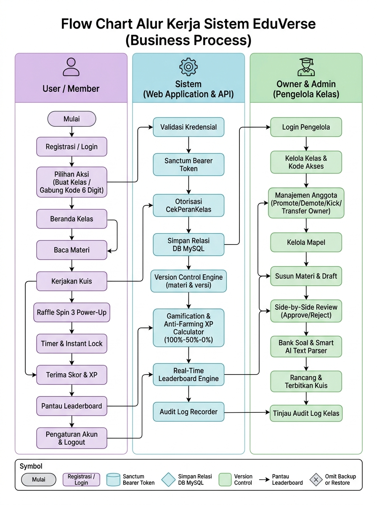
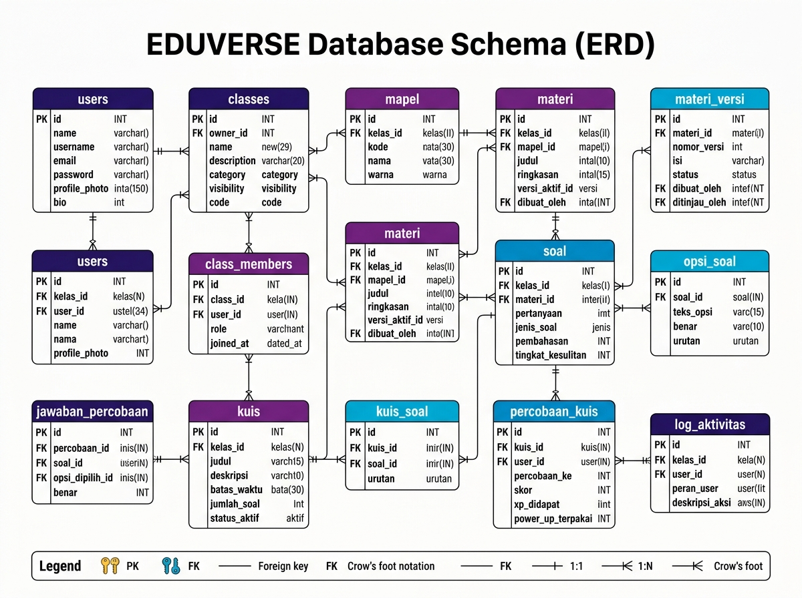
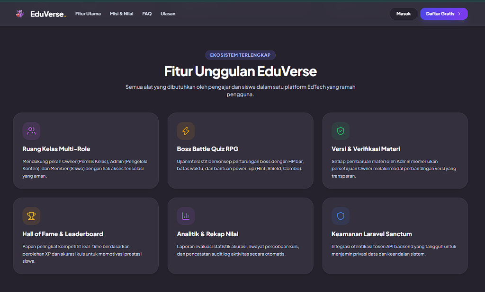
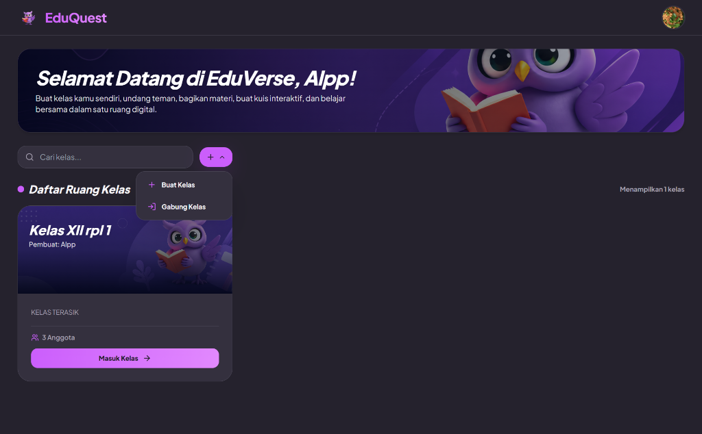

<p align="center">
  
</p>

# LAPORAN
## PROYEK PEMBUATAN APLIKASI BERBASIS WEB
# “EduVerse”
### (Platform Pembelajaran Berbasis Kelas Mandiri & Gamifikasi Kuis Interaktif)

<br>

Disusun untuk memenuhi salah satu persyaratan ketuntasan studi pada mata pelajaran Pemrograman WEB dan Application Programming Interface (API) di SMK Negeri 13 Bandung, kompetensi keahlian Rekayasa Perangkat Lunak (RPL).

<br>

**Disusun oleh :**  
**Refky Satria**  
**NIS: 102419370**  
**Kelas: XII RPL 1**  

**Kompetensi Keahlian : Rekayasa Perangkat Lunak**

<br>

<p align="center">
  <b>PEMERINTAH PROVINSI JAWA BARAT</b><br>
  <b>DINAS PENDIDIKAN</b><br>
  <b>SEKOLAH MENENGAH KEJURUAN NEGERI 13 BANDUNG</b><br>
  <b>KOMPETENSI KEAHLIAN REKAYASA PERANGKAT LUNAK</b><br>
  Jl. Soekarno-Hatta KM.10 Bandung-40286; Telp/Fax (022) 7318960<br>
  Home page : www.smkn-13bdg.sch.id &nbsp;|&nbsp; Email : smkn13bdg@gmail.com<br>
  <b>Tahun 2026</b>
</p>

---

<div style="page-break-after: always;"></div>

# LEMBAR PERSETUJUAN

| | |
|---|---|
| **Judul Laporan** | : Aplikasi Berbasis Web “EduVerse” |
| **Penulis** | : |
| **Nama** | : Refky Satria |
| **NIS** | : 102419370 |
| **Tanggal** | : 28 September 2026 |

<br><br>

<p align="center">
  Disetujui oleh<br>
  <b>Pembimbing,</b>
  <br><br><br><br><br>
  <b><u>Ariantonius Sagala, S.Kom., M.Kom.</u></b><br>
  NIP. 197809272022211002
</p>

---

<div style="page-break-after: always;"></div>

# HALAMAN IDENTITAS SISWA

| | |
|---|---|
| **Nama Siswa** | : Refky Satria |
| **Tempat/Tanggal Lahir** | : Bandung, 12 Oktober 2008 |
| **Jenis Kelamin** | : Laki-laki |
| **Golongan Darah** | : O |
| **Nomor Induk Siswa** | : 102419370 |
| **Nama Sekolah** | : SMK Negeri 13 Bandung |
| **Alamat Sekolah** | : Jl. Soekarno-Hatta KM. 10, Kelurahan Jatisari, Kecamatan Buahbatu, Kota Bandung, Jawa Barat 40286 |
| **Nomor Telp. Sekolah** | : (022) 7318960 |

<br>

```
+-------------------------------------------------------------+
|                                                             |
|                                                             |
|                [ TEMPAT PAS FOTO SISWA 3x4 ]                |
|                                                             |
|                                                             |
+-------------------------------------------------------------+
```

<br>

<p align="right">
  Yang bersangkutan,<br><br><br><br>
  <b><u>Refky Satria</u></b>
</p>

---

<div style="page-break-after: always;"></div>

# KATA PENGANTAR

Puji dan syukur ke hadirat Tuhan Yang Maha Esa karena atas rahmat dan karunia-Nya, laporan projek aplikasi dengan judul **“EduVerse”** ini dapat diselesaikan dengan baik.

Laporan ini disusun sebagai dokumentasi proses perancangan, pengembangan, dan penggunaan aplikasi EduVerse, yaitu aplikasi berbasis web yang dirancang sebagai ruang kelas digital desentralistik bagi pengguna untuk mengelola kelas secara mandiri, membagikan materi pembelajaran dengan kendali versi (version control), menyelenggarakan evaluasi melalui kuis interaktif yang digamifikasi, serta memantau perkembangan kompetensi melalui papan peringkat skor dan poin pengalaman (XP) secara terstruktur.

Dalam proses pengembangannya, aplikasi EduVerse memanfaatkan teknologi web modern yang terdiri dari Laravel 12 (RESTful API), React, JavaScript, Vite, Tailwind CSS, serta basis data relasional MySQL. Aplikasi ini juga dirancang dengan memperhatikan kemudahan penggunaan melalui antarmuka bergaya glassmorphism modern, responsif, ramah seluler (mobile-first), serta dukungan alur kerja verifikasi materi dua arah (Owner Review). Selain fitur utama, EduVerse juga dikembangkan dengan fitur lanjutan seperti integrasi kecerdasan buatan Smart AI Text Parser untuk impor bank soal otomatis serta modul Audit Log Aktivitas Kelas untuk mendukung transparansi dan integritas pengelolaan ruang kelas.

Penyusunan laporan ini bertujuan untuk memberikan penjelasan secara sistematis mengenai latar belakang, perancangan sistem, teknologi yang digunakan, alur penggunaan aplikasi, fitur-fitur yang tersedia, serta pengujian dan pemecahan masalah yang terdapat pada aplikasi EduVerse.

Penulis menyadari bahwa laporan ini masih memiliki kekurangan. Oleh karena itu, kritik dan saran yang membangun sangat diharapkan untuk membantu meningkatkan kualitas aplikasi maupun laporan ini di masa mendatang.

Akhir kata, penulis berharap laporan dan aplikasi EduVerse ini dapat memberikan manfaat serta menjadi dokumentasi yang bermanfaat dari proses pembelajaran dan pengembangan projek yang telah dilakukan.

<br>

<p align="right">
  Bandung, 28 September 2026<br><br>
  <b>Penulis</b>
</p>

---

<div style="page-break-after: always;"></div>

# UCAPAN TERIMA KASIH

Dalam proses penyusunan laporan dan pengembangan aplikasi EduVerse, penulis mendapatkan banyak bantuan, bimbingan, arahan, serta dukungan moral maupun material dari berbagai pihak. Oleh karena itu, dengan penuh rasa hormat penulis menyampaikan ucapan terima kasih yang sebesar-besarnya kepada:

1. **Tuhan Yang Maha Esa** yang telah melimpahkan kesehatan, kekuatan, kelancaran, dan kemudahan selama proses pembelajaran serta penyelesaian pengerjaan projek ini.
2. **Orang tua dan keluarga tercinta** yang senantiasa memberikan doa, motivasi, kasih sayang, serta dukungan moril maupun materiil selama proses pengerjaan projek.
3. **Bapak/Ibu Kepala SMK Negeri 13 Bandung** yang telah memfasilitasi dan memberikan kesempatan kepada penulis untuk mengikuti kegiatan pembelajaran dan penyelesaian projek ini dengan baik.
4. **Bapak/Ibu Guru dan Pembimbing Program Keahlian Rekayasa Perangkat Lunak SMK Negeri 13 Bandung**, khususnya **Bapak Ariantonius Sagala, S.Kom., M.Kom.** yang telah membimbing, mentransfer ilmu, dan memberikan arahan berharga selama proses pengerjaan aplikasi serta laporan.
5. **Rekan-rekan satu angkatan Program Keahlian Rekayasa Perangkat Lunak** atas kebersamaan, diskusi yang membangun, saran, serta semangat kerja sama selama proses perancangan dan pengembangan aplikasi.
6. **Seluruh pihak yang telah membantu baik secara langsung maupun tidak langsung** yang tidak dapat penulis sebutkan satu per satu dalam penyelesaian aplikasi EduVerse dan penyusunan laporan ini.

Penulis berdoa semoga segala kebaikan, bimbingan, dan bantuan yang telah diberikan senantiasa mendapat balasan yang berlipat ganda dari Tuhan Yang Maha Esa.

---

<div style="page-break-after: always;"></div>

# LEMBAR PENGESAHAN

### “EDUVERSE”
### WEB LEARNING MANAGEMENT SYSTEM & GAMIFIED QUIZ PLATFORM

<br>

Telah diperiksa dan disetujui sebagai salah satu bentuk dokumentasi hasil projek pembelajaran Program Keahlian Rekayasa Perangkat Lunak di SMK Negeri 13 Bandung.

<br>

| | |
|---|---|
| **Nama** | : Refky Satria |
| **NIS** | : 102419370 |
| **Kelas** | : XII RPL 1 |
| **Program Keahlian** | : Rekayasa Perangkat Lunak |

<br>

<p align="center">Bandung, 28 September 2026</p>

<table style="width: 100%; border: none;">
  <tr style="border: none;">
    <td style="width: 50%; text-align: center; border: none;">
      Mengetahui,<br>
      <b>Kepala SMK Negeri 13 Bandung</b>
      <br><br><br><br><br>
      (.......................................................)<br>
      NIP. ...................................................
    </td>
    <td style="width: 50%; text-align: center; border: none;">
      Menyetujui,<br>
      <b>Guru Pembimbing</b>
      <br><br><br><br><br>
      <b><u>Ariantonius Sagala, S.Kom., M.Kom.</u></b><br>
      NIP. 197809272022211002
    </td>
  </tr>
  <tr style="border: none;">
    <td colspan="2" style="text-align: center; border: none; padding-top: 40px;">
      Mengetahui,<br>
      <b>Ketua Program Keahlian Rekayasa Perangkat Lunak</b>
      <br><br><br><br><br>
      (.......................................................)<br>
      NIP. ...................................................
    </td>
  </tr>
</table>

---

<div style="page-break-after: always;"></div>

# DAFTAR ISI

- [LAPORAN](#laporan)
- [LEMBAR PERSETUJUAN](#lembar-persetujuan)
- [HALAMAN IDENTITAS SISWA](#halaman-identitas-siswa)
- [KATA PENGANTAR](#kata-pengantar)
- [UCAPAN TERIMA KASIH](#ucapan-terima-kasih)
- [LEMBAR PENGESAHAN](#lembar-pengesahan)
- [DAFTAR ISI](#daftar-isi)
- [BAB I: PENDAHULUAN](#bab-i-pendahuluan)
  - [1.1 Latar Belakang & Tujuan Website](#11-latar-belakang--tujuan-website)
    - [1.1.1 Latar Belakang](#111-latar-belakang)
    - [1.1.2 Tujuan Website](#112-tujuan-website)
  - [1.2 Target Pengguna (User Roles)](#12-target-pengguna-user-roles)
    - [1.2.1 Anggota Kelas (Member)](#121-anggota-kelas-member)
    - [1.2.2 Pemilik Kelas (Owner) dan Asisten (Admin)](#122-pemilik-kelas-owner-dan-asisten-admin)
    - [1.2.3 Matriks Perbandingan Hak Akses](#123-matriks-perbandingan-hak-akses)
  - [1.3 Kebutuhan Sistem (Minimum Hardware & Software Requirement)](#13-kebutuhan-sistem-minimum-hardware--software-requirement)
    - [1.3.1 Kebutuhan Perangkat Keras](#131-kebutuhan-perangkat-keras)
    - [1.3.2 Kebutuhan Perangkat Lunak](#132-kebutuhan-perangkat-lunak)
    - [1.3.3 Browser](#133-browser)
    - [1.3.4 Kebutuhan Database](#134-kebutuhan-database)
    - [1.3.5 Kebutuhan Koneksi Internet](#135-kebutuhan-koneksi-internet)
- [BAB II: ARSITEKTUR DAN PERANCANGAN SISTEM](#bab-ii-arsitektur-dan-perancangan-sistem)
  - [2.1 Alur Kerja Sistem (Business Process)](#21-alur-kerja-sistem-business-process)
  - [2.2 Teknologi (Bahasa Pemrograman, Framework, Database)](#22-teknologi-bahasa-pemrograman-framework-database)
  - [2.3 Perancangan Basis Data (ERD / Struktur Tabel)](#23-perancangan-basis-data-erd--struktur-tabel)
- [BAB III: MEMULAI APLIKASI](#bab-iii-memulai-aplikasi)
  - [3.1 Cara Akses atau Instalasi (Web/Desktop/Mobile)](#31-cara-akses-atau-instalasi-webdesktopmobile)
  - [3.2 Halaman Utama & Tampilan Antarmuka (UI Overview)](#32-halaman-utama--tampilan-antarmuka-ui-overview)
  - [3.3 Prosedur Registrasi & Pembuatan Akun Baru](#33-prosedur-registrasi--pembuatan-akun-baru)
  - [3.4 Panduan Login dan Logout](#34-panduan-login-dan-logout)
- [BAB IV: MANAJEMEN AKUN DAN PENGATURAN](#bab-iv-manajemen-akun-dan-pengaturan)
  - [4.1 Mengubah Profil Pengguna & Kata Sandi](#41-mengubah-profil-pengguna--kata-sandi)
  - [4.2 Pengaturan Hak Akses (Role Management)](#42-pengaturan-hak-akses-role-management)
  - [4.3 Konfigurasi Umum Aplikasi](#43-konfigurasi-umum-aplikasi)
- [BAB V: FITUR UTAMA APLIKASI (CORE FEATURES)](#bab-v-fitur-utama-aplikasi-core-features)
  - [5.1 Modul Dashboard & Beranda Kelas](#51-modul-dashboard--beranda-kelas)
    - [5.1.1 Penjelasan Fitur](#511-penjelasan-fitur)
    - [5.1.2 Tampilan Dashboard](#512-tampilan-dashboard)
    - [5.1.3 Cara Menggunakan Dashboard](#513-cara-menggunakan-dashboard)
  - [5.2 Modul Manajemen Materi & Version Control](#52-modul-manajemen-materi--version-control)
    - [5.2.1 Konsep & Fungsi Fitur](#521-konsep--fungsi-fitur)
    - [5.2.2 Skala Status Verifikasi & Aturan Version Control](#522-skala-status-verifikasi--aturan-version-control)
    - [5.2.3 Tampilan Antarmuka Modul Materi](#523-tampilan-antarmuka-modul-materi)
    - [5.2.4 Prosedur Pembuatan & Pengajuan Draf Materi Baru](#524-prosedur-pembuatan--pengajuan-draf-materi-baru)
    - [5.2.5 Verifikasi & Review Materi Side-by-Side (Owner Review)](#525-verifikasi--review-materi-side-by-side-owner-review)
    - [5.2.6 Riwayat Versi Materi (Version History)](#526-riwayat-versi-materi-version-history)
  - [5.3 Modul Kuis Gamifikasi & Power-Up](#53-modul-kuis-gamifikasi--power-up)
    - [5.3.1 Penjelasan Fitur](#531-penjelasan-fitur)
    - [5.3.2 Tampilan Halaman Kuis](#532-tampilan-halaman-kuis)
    - [5.3.3 Pembuatan Kuis Baru & Bank Soal](#533-pembuatan-kuis-baru--bank-soal)
    - [5.3.4 Prosedur Pengerjaan Kuis Interaktif](#534-prosedur-pengerjaan-kuis-interaktif)
  - [5.4 Modul Leaderboard & Sistem XP](#54-modul-leaderboard--sistem-xp)
    - [5.4.1 Konsep Leaderboard & Sistem XP](#541-konsep-leaderboard--sistem-xp)
    - [5.4.2 Kurva XP Bertingkat (Anti-Farming Curve)](#542-kurva-xp-bertingkat-anti-farming-curve)
    - [5.4.3 Tampilan Antarmuka Leaderboard](#543-tampilan-antarmuka-leaderboard)
    - [5.4.4 Visualisasi Data & Statistik Peringkat](#544-visualisasi-data--statistik-peringkat)
    - [5.4.5 Interaksi dengan Data Leaderboard](#545-interaksi-dengan-data-leaderboard)
- [BAB VI: PANDUAN LANJUTAN (ADVANCED FEATURES)](#bab-vi-panduan-lanjutan-advanced-features)
  - [6.1 Integrasi dengan Sistem Lain](#61-integrasi-dengan-sistem-lain)
    - [6.1.1 Alur Integrasi Smart AI Text Parser](#611-alur-integrasi-smart-ai-text-parser)
    - [6.1.2 Pengelolaan Bank Soal & Impor Teks AI](#612-pengelolaan-bank-soal--impor-teks-ai)
    - [6.1.3 Fitur Otomatisasi Ekstraksi Soal AI](#613-fitur-otomatisasi-ekstraksi-soal-ai)
  - [6.2 Sistem Audit Log & Riwayat Aktivitas Kelas](#62-sistem-audit-log--riwayat-aktivitas-kelas)
    - [6.2.1 Konsep & Fungsi Audit Log](#621-konsep--fungsi-audit-log)
    - [6.2.2 Kategori Rekaman Aktivitas](#622-kategori-rekaman-aktivitas)
    - [6.2.3 Tampilan Antarmuka Audit Log](#623-tampilan-antarmuka-audit-log)
    - [6.2.4 Mekanisme Pencatatan Otomatis pada Backend](#624-mekanisme-pencatatan-otomatis-pada-backend)
- [BAB VII: PEMECAHAN MASALAH (TROUBLESHOOTING)](#bab-vii-pemecahan-masalah-troubleshooting)
  - [7.1 Kendala Umum dan Solusinya](#71-kendala-umum-dan-solusinya)
    - [7.1.1 Website Tidak Dapat Diakses](#711-website-tidak-dapat-diakses)
    - [7.1.2 Gagal Login](#712-gagal-login)
    - [7.1.3 Gagal Registrasi Akun](#713-gagal-registrasi-akun)
    - [7.1.4 Data Tidak Tersimpan](#714-data-tidak-tersimpan)
    - [7.1.5 Data Tidak Muncul pada Halaman](#715-data-tidak-muncul-pada-halaman)
    - [7.1.6 Peringkat Leaderboard / XP Tidak Bertambah](#716-peringkat-leaderboard--xp-tidak-bertambah)
    - [7.1.7 Smart AI Text Parser Gagal Membaca Soal](#717-smart-ai-text-parser-gagal-membaca-soal)
    - [7.1.8 Power-Up Kuis Tidak Muncul](#718-power-up-kuis-tidak-muncul)
    - [7.1.9 Gagal Mengunggah Berkas Lampiran Materi](#719-gagal-mengunggah-berkas-lampiran-materi)
    - [7.1.10 Kode Undangan Kelas Tidak Valid](#7110-kode-undangan-kelas-tidak-valid)
    - [7.1.11 Tidak Dapat Mengubah Profil atau Kata Sandi](#7111-tidak-dapat-mengubah-profil-atau-kata-sandi)
    - [7.1.12 Website Menampilkan Pesan Error (CORS / 401 / 403)](#7112-website-menampilkan-pesan-error-cors--401--403)
  - [7.2 Panduan Penanganan Error](#72-panduan-penanganan-error)
  - [7.3 Error yang Sering Ditemukan pada Tahap Pengembangan](#73-error-yang-sering-ditemukan-pada-tahap-pengembangan)
  - [7.4 Pencegahan Kehilangan Data](#74-pencegahan-kehilangan-data)
- [PENUTUP](#penutup)
  - [A. Kesimpulan](#a-kesimpulan)
  - [B. Saran](#b-saran)
- [DAFTAR PUSTAKA](#daftar-pustaka)
- [LAMPIRAN](#lampiran)

---

<div style="page-break-after: always;"></div>

# BAB I
# PENDAHULUAN

## 1.1 Latar Belakang & Tujuan Website

### 1.1.1 Latar Belakang

Perkembangan teknologi informasi telah memberikan banyak kemudahan dalam membantu aktivitas sehari-hari. Salah satu penerapannya adalah pemanfaatan website sebagai media untuk mencatat, mengelola, dan menyajikan informasi secara lebih terstruktur dan efisien. Dalam dunia pendidikan modern, interaksi pembelajaran membutuhkan media digital yang tidak hanya berfungsi sebagai repositori dokumen pasif, melainkan mampu memicu motivasi belajar, kolaborasi aktif, serta evaluasi kompetensi secara berkesinambungan.

Namun, banyak platform *Learning Management System* (LMS) konvensional yang beredar saat ini bersifat kaku dan sentralistik (*centralized*). Pada sistem tradisional tersebut, ruang kelas hanya dapat dibuat dan diatur oleh administrator pusat institusi tertentu, sehingga membatasi inisiatif pengajar independen, kelompok studi sebaya (peer study groups), komunitas belajar daring, maupun asisten pengajar yang ingin membentuk lingkungan belajarnya sendiri secara mandiri dan cepat. Selain itu, proses evaluasi hasil belajar melalui kuis atau ujian daring sering kali terasa monoton, minim interaktivitas, dan tidak memberikan apresiasi psikologis yang menyenangkan bagi peserta didik.

Ketiadaan platform pembelajaran yang memadukan kebebasan pengelolaan kelas dengan pendekatan interaktif menyebabkan rendahnya tingkat partisipasi dan keterikatan siswa dalam mengikuti materi hingga tuntas. Pembelajaran digital yang tidak didukung oleh mekanisme umpan balik seketika dan elemen motivasional cenderung menciptakan rasa jenuh serta memicu penurunan konsistensi belajar.

Berdasarkan permasalahan tersebut, dikembangkanlah **EduVerse**, yaitu platform website yang difungsikan sebagai ruang belajar digital mandiri dan interaktif (*collaborative & gamified learning space*) bagi pengguna. Melalui EduVerse, pengguna dapat membuat dan mengelola ruang kelas mandiri, menyusun serta memverifikasi materi ajar dengan kendali versi (version control), membuat bank soal terstruktur, menyelenggarakan kuis interaktif dengan sistem bantuan *Power-Up*, serta memantau perkembangan poin pengalaman (*Experience Points* / XP) dan peringkat kompetensi melalui papan peringkat (*Leaderboard*) yang informatif dan transparan.

Aplikasi ini dirancang dengan mengutamakan kenyamanan pengalaman pengguna (*user experience*), memadukan estetika antarmuka modern bernuansa *glassmorphism*, tata letak yang responsif dan ramah seluler (*mobile-first*), serta transisi animasi yang lembut. Selain itu, EduVerse mengintegrasikan kecerdasan buatan berupa *Smart AI Text Parser* untuk membantu pengajar mengekstrak butir soal pilihan ganda secara otomatis dari format teks hasil generasi AI, serta modul *Audit Log Aktivitas Kelas* guna menjamin transparansi, akuntabilitas, dan integritas pengelolaan ruang kelas.

Dengan hadirnya EduVerse, peserta didik dan pengajar diharapkan memiliki satu platform terpadu yang memfasilitasi proses pembelajaran mandiri secara rutin, menyenangkan, teratur, dan mendalam.

### 1.1.2 Tujuan Website

Adapun tujuan dari perancangan dan pengembangan aplikasi EduVerse adalah sebagai berikut:

1. Menyediakan media digital yang intuitif untuk membantu pengguna membuat, mengelola, dan bergabung ke dalam ruang kelas mandiri tanpa ketergantungan pada birokrasi sistem terpusat.
2. Menyediakan modul Materi interaktif yang dilengkapi alur kerja verifikasi dua arah (*Owner Review*) dan sistem kendali versi (*version control*) guna menjamin keabsahan isi konten pembelajaran.
3. Menghadirkan modul kuis interaktif yang digamifikasi dengan mekanisme *Power-Up* (seperti Hint, 50:50, Scanner, Kotak Misteri, Shield) untuk menciptakan pengalaman evaluasi yang menyenangkan menyerupai game.
4. Menyediakan modul analitik *Leaderboard* dan sistem poin *Experience Points* (XP) yang dilengkapi kurva anti-farming guna menyajikan peringkat dan motivasi kompetitif yang sehat antar peserta didik.
5. Menjamin kenyamanan interaksi pengguna melalui tata letak antarmuka yang responsif, bersih, berestetika tinggi dengan sentuhan *glassmorphism*, dan transisi visual yang halus.
6. Menyediakan fleksibilitas peran berbasis konteks kelas (*Class-Scoped Roles*) di mana seorang pengguna dapat berperan sebagai Owner pada kelas buatannya, sekaligus menjadi Admin atau Member di kelas lain.
7. Mengembangkan modul integrasi *Smart AI Text Parser* sebagai sarana percepatan pembuatan bank soal dari respons model bahasa besar (LLM).
8. Mengimplementasikan sistem autentikasi stateless berbasis token (*Laravel Sanctum*) dan kontrol akses berbasis peran (*Role-Based Access Control*) demi keamanan data pengguna.
9. Menyediakan modul *Audit Log Aktivitas Kelas* guna merekam seluruh rekam jejak aksi penting pengajar dan siswa demi terciptanya lingkungan belajar yang transparan dan akuntabel.

---

## 1.2 Target Pengguna (User Roles)

Arsitektur sistem EduVerse membedakan hak akses dan wewenang pengguna berdasarkan konteks ruang kelas (*Class-Scoped Roles*) menjadi tiga entitas peran utama, yaitu **Anggota Kelas (Member)**, **Asisten Pengelola (Admin)**, dan **Pemilik Kelas (Owner)**.

### 1.2.1 Anggota Kelas (Member)

Member adalah pengguna terdaftar yang bergabung ke dalam suatu ruang kelas untuk mengikuti rangkaian proses pembelajaran dan evaluasi. Hak akses yang dimiliki oleh entitas Member mencakup:

- Melakukan pendaftaran akun (registrasi) mandiri dan masuk ke dalam sistem (login).
- Memperbarui informasi profil pengguna, foto profil (avatar), bio diri, dan mengubah preferensi akun.
- Membuat ruang kelas baru (otomatis menjadi Owner di kelas tersebut) atau bergabung ke kelas lain menggunakan kode akses 6 karakter unik.
- Membaca, mempelajari, dan meninjau seluruh materi pembelajaran yang telah berstatus *Terverifikasi*.
- Melihat riwayat versi materi (*Version History*) yang telah disetujui.
- Mengerjakan kuis evaluasi pembelajaran, memutar undian *Raffle Spin Power-Up*, dan menggunakan item bantuan selama pengerjaan kuis.
- Memperoleh perolehan poin pengalaman (XP) berdasarkan capaian skor kuis dengan regulasi kurva anti-farming.
- Meninjau papan peringkat kelas (*Leaderboard*) untuk memantau peringkat XP diri sendiri dan rekan sekelas secara real-time.
- Memilih untuk keluar (*Leave*) dari ruang kelas yang diikutinya secara mandiri.

*Catatan: Seluruh data capaian nilai dan kepemilikan draf materi diisolasi secara ketat oleh sistem otorisasi, sehingga pengguna Member tidak dapat mengubah konfigurasi kelas atau menghapus data anggota lain.*

### 1.2.2 Pemilik Kelas (Owner) dan Asisten (Admin)

Pengelolaan ruang kelas dijalankan oleh Owner dan didukung oleh Admin yang ditunjuk untuk memelihara konten serta aktivitas kelas:

- **Pemilik Kelas (Owner):** Pengguna yang mendirikan kelas. Memegang wewenang mutlak tertinggi atas ruang kelas tersebut, meliputi hak mengubah metadata kelas (nama, deskripsi, kategori, visibilitas), mereset/meregenerasi kode undangan kelas, mengelola keanggotaan (mengangkat Member menjadi Admin, menurunkan Admin menjadi Member, atau mengeluarkan anggota/kick), meninjau dan memverifikasi (*Approve/Reject*) draf materi baru yang diajukan oleh Admin dengan fitur *Side-by-Side Comparison*, serta menghapus ruang kelas secara permanen.
- **Asisten Pengelola (Admin):** Pengguna yang dipercaya oleh Owner untuk membantu tata kelola operasional pembelajaran. Memiliki wewenang untuk mengelola katalog mata pelajaran (Mapel), menyusun draf materi pembelajaran baru (yang akan dikirim ke antrean verifikasi Owner), mengelola bank soal kelas (menambah, mengedit, menghapus, atau mengimpor via *Smart AI Text Parser*), serta merancang dan menerbitkan kuis baru. Namun, Admin tidak memiliki wewenang untuk mengeluarkan anggota atau menyetujui draf materinya sendiri.

### 1.2.3 Matriks Perbandingan Hak Akses

Berikut adalah matriks pembagian kewenangan antara peran Member, Admin, dan Owner pada sistem EduVerse:

| Fitur / Hak Akses | Member | Admin | Owner |
|---|:---:|:---:|:---:|
| Registrasi Akun & Login Mandiri | ✓ | ✓ | ✓ |
| Pengelolaan Profil Pribadi & Avatar | ✓ | ✓ | ✓ |
| Bergabung ke Ruang Kelas via Kode | ✓ | ✓ | ✓ |
| Membuat Ruang Kelas Baru (Jadi Owner) | ✓ | ✓ | ✓ |
| Membaca Materi Berstatus Terverifikasi | ✓ | ✓ | ✓ |
| Mengerjakan Kuis Interaktif & Power-Up | ✓ | ✓ | ✓ |
| Meninjau Papan Peringkat Leaderboard | ✓ | ✓ | ✓ |
| Keluar dari Kelas Mandiri (*Leave Class*) | ✓ | ✓ | - |
| Mengelola Mata Pelajaran (Mapel) | - | ✓ | ✓ |
| Membuat & Mengajukan Draf Materi | - | ✓ | ✓ |
| Kelola Bank Soal & Impor Teks AI | - | ✓ | ✓ |
| Merancang & Mengaktifkan Kuis Baru | - | ✓ | ✓ |
| Menyetujui / Menolak Draf Materi (*Verify*) | - | - | ✓ |
| Mengangkat / Menurunkan Peran Admin | - | - | ✓ |
| Mengeluarkan Anggota dari Kelas (*Kick*) | - | - | ✓ |
| Mengubah Pengaturan & Kode Akses Kelas | - | - | ✓ |
| Menghapus Ruang Kelas Permanen | - | - | ✓ |
| Meninjau Audit Log Aktivitas Kelas | - | ✓ | ✓ |

---

## 1.3 Kebutuhan Sistem (Minimum Hardware & Software Requirement)

Untuk memastikan proses pengembangan dan pengoperasian aplikasi EduVerse berjalan secara optimal, diperlukan spesifikasi perangkat keras dan lingkungan perangkat lunak dengan ketentuan minimum sebagai berikut:

### 1.3.1 Kebutuhan Perangkat Keras

#### A. Komputer/Laptop Pengembang (Development Workstation)

| Komponen | Spesifikasi Minimum | Rekomendasi Pengembang |
|---|---|---|
| **Processor** | Intel Core i3 / AMD Ryzen 3 atau setara (Dual-Core 2.0 GHz) | Intel Core i5 / AMD Ryzen 5 (Hexa-Core 3.0 GHz+) |
| **RAM** | 8 GB DDR4 | 16 GB DDR4 / DDR5 High Speed |
| **Penyimpanan** | SSD dengan ruang kosong minimal 10 GB | NVMe SSD 256 GB+ ruang kosong |
| **Resolusi Layar** | Minimal 1366 × 768 piksel | Minimal 1920 × 1080 Full HD IPS |
| **Koneksi Internet** | Koneksi stabil 5 Mbps untuk instalasi paket dependency | Koneksi pita lebar dedicated 20+ Mbps |

#### B. Perangkat Pengguna (End-User Device)

Aplikasi EduVerse mengusung konsep *responsive web design* dengan orientasi *mobile-first*, sehingga dapat diakses secara fleksibel menggunakan komputer desktop, laptop, tablet, maupun smartphone yang terpasang penjelajah web modern dengan resolusi layar minimal 360 × 640 piksel dan memori RAM minimal 2 GB.

### 1.3.2 Kebutuhan Perangkat Lunak

Ekosistem perangkat lunak yang digunakan dalam perancangan dan pengembangan aplikasi EduVerse dijabarkan pada tabel berikut:

| Perangkat Lunak / Teknologi | Fungsi Utama |
|---|---|
| **Visual Studio Code** | Code editor utama untuk penulisan dan pengembangan modul kode sumber backend dan frontend |
| **Laravel 12** | Framework PHP modern untuk sisi backend dan penyediaan RESTful API terstruktur |
| **PHP 8.2+** | Bahasa pemrograman inti pada sisi server (backend) untuk mengeksekusi logika bisnis |
| **MySQL 8.0+ / MariaDB** | Relational Database Management System (RDBMS) untuk persistensi data dan integritas relasional |
| **React (v18 / v19)** | Pustaka (library) JavaScript untuk merancang antarmuka pengguna berbasis komponen reaktif modular |
| **JavaScript (ES6+)** | Bahasa pemrograman dinamis untuk logika interaksi dan penanganan event di sisi klien (frontend) |
| **Vite (v6.x)** | Development server berkecepatan tinggi dan build tool modern untuk bundling aset frontend |
| **Tailwind CSS & Vanilla CSS**| Framework CSS utility-first dan custom CSS untuk styling estetika glassmorphism dan tata letak responsif |
| **Lucide React** | Pustaka ikon modern berbasis vektor SVG yang seragam, bersih, dan berbobot ringan |
| **Laravel Sanctum** | Paket middleware autentikasi token berbasis bearer untuk mengamankan komunikasi API Single Page Application |
| **Composer (v2.6+)** | Dependency management tool untuk ekosistem paket dan library bahasa PHP |
| **Node.js (v18+ / v20+ LTS) & npm** | Runtime environment JavaScript serta package manager dependensi modul frontend |
| **Git** | Sistem kontrol versi (Version Control System) untuk kolaborasi kode dan pelacakan riwayat revisi |
| **Web Browser** | Platform penjelajah web untuk menjalankan, menguji, dan mengevaluasi antarmuka aplikasi |

### 1.3.3 Browser

Aplikasi EduVerse dioptimalkan untuk beroperasi pada peramban web modern yang mendukung spesifikasi HTML5, CSS3 (backdrop-filter untuk glassmorphism), dan ECMAScript 6+, antara lain:

- Google Chrome (versi terbaru)
- Microsoft Edge (versi terbaru)
- Mozilla Firefox (versi terbaru)
- Apple Safari (versi terbaru)

Penggunaan peramban versi mutakhir sangat direkomendasikan agar kinerja efek visual glassmorphism, timer kuis interaktif, dan penanganan token sesi berjalan lancar tanpa kendala kompatibilitas.

### 1.3.4 Kebutuhan Database

EduVerse mengimplementasikan sistem basis data relasional MySQL untuk menyimpan seluruh entitas data secara konsisten. Tabel-tabel yang dikelola mencakup autentikasi akun pengguna (`users`), data ruang kelas (`classes`), relasi keanggotaan dan peran (`class_members`), master mata pelajaran (`mapel`), master materi (`materi`), riwayat versi materi (`materi_versi`), bank soal (`soal`), opsi jawaban (`opsi_soal`), master kuis (`kuis`), relasi butir kuis (`kuis_soal`), rekapitulasi percobaan kuis (`percobaan_kuis`), rincian jawaban kuis (`jawaban_percobaan`), serta rekam jejak audit aktivitas sistem (`log_aktivitas`). Struktur basis data dinormalisasi hingga bentuk Third Normal Form (3NF) guna mencegah redundansi data, menjaga integritas referensial melalui *Foreign Key Constraints*, dan mempercepat waktu eksekusi query.

### 1.3.5 Kebutuhan Koneksi Internet

Aplikasi EduVerse dapat dijalankan pada jaringan lokal (*localhost / offline environment*) setelah seluruh dependensi terpasang. Namun demikian, ketersediaan koneksi internet tetap dibutuhkan untuk:

1. Pengunduhan dan pembaruan dependensi melalui Composer serta npm saat proses setup awal.
2. Pengambilan aset eksternal seperti font tipografi daring (Google Fonts) atau generator soal AI eksternal.
3. Kebutuhan sinkronisasi kode pada repositori Git GitHub serta deployment ke server produksi (*production cloud hosting*).

---

<div style="page-break-after: always;"></div>

# BAB II
# ARSITEKTUR DAN PERANCANGAN SISTEM

## 2.1 Alur Kerja Sistem (Business Process)

Alur operasional sistem EduVerse digambarkan melalui diagram alur kerja (*swimlane flowchart*) yang membagi tanggung jawab ke dalam tiga entitas utama: **User (Anggota / Pengajar)**, **Sistem (Web Application & API)**, dan **Owner/Admin (Pengelola Kelas)**.

<br>

<p align="center">
  
</p>
<p align="center"><i>Gambar 2.1. Alur kerja aplikasi (Business Process)</i></p>

<br>

### 1. Alur Interaksi Pengguna (User / Member)

- **Akses Awal & Gerbang Masuk:** Alur dimulai ketika pengguna membuka alamat web EduVerse melalui peramban. Sistem mendeteksi status autentikasi di penyimpanan lokal (*localStorage*).
- **Proses Autentikasi & Registrasi:**
  - Apabila pengguna belum memiliki akun, pengguna memilih opsi **Registrasi**, mengisi data (Nama Lengkap, Username unik, Alamat Email, Password, dan Konfirmasi Password). Sistem memvalidasi keunikan data dan melakukan hashing password dengan algoritma Bcrypt.
  - Apabila sudah memiliki akun, pengguna melakukan **Login** memasukkan email dan password. Sistem memverifikasi kredensial dan menerbitkan token otentikasi stateless *Laravel Sanctum* (Bearer Token).
- **Aktivitas Dashboard Kelas (My Classes):** Setelah berhasil masuk, pengguna disajikan halaman utama berisi seluruh ruang kelas yang diikutinya:
  - **Mendirikan Kelas Baru:** Pengguna dapat membuat ruang kelas mandiri dengan menentukan nama kelas, kategori pelajaran, visibilitas (publik/privat), dan deskripsi. Pengguna yang membuat kelas otomatis berstatus sebagai **Owner**.
  - **Bergabung ke Ruang Kelas:** Pengguna dapat bergabung ke ruang kelas lain yang dibuat oleh pengajar/rekan dengan memasukkan 6 karakter kode akses unik. Pengguna otomatis tercatat sebagai **Member**.
- **Aktivitas di dalam Ruang Kelas Aktif:**
  - **Mempelajari Materi Pembelajaran:** Mengakses tab Materi, memfilter berdasarkan mata pelajaran (Mapel), membaca artikel materi terverifikasi, dan membuka riwayat versi (*Version History*) dokumen.
  - **Mengikuti Evaluasi Kuis Gamifikasi:** Memilih kuis yang sedang dibuka, mengikuti fase undian *Raffle Spin* untuk memperoleh 3 Power-Up bantuan acak, mengerjakan soal pilihan ganda di bawah tekanan batas waktu (*countdown timer*), serta menyaksikan umpan balik jawaban seketika (*instant lock feedback*).
  - **Menerima Skor & Poin Pengalaman (XP):** Meninjau rekapitulasi nilai akhir dan penerimaan poin pengalaman yang telah dihitung berdasarkan aturan kurva anti-farming.
  - **Memantau Peringkat Kompetisi (Leaderboard):** Meninjau pergerakan posisi peringkat kelas pada papan peringkat XP real-time untuk melihat posisi diri terhadap seluruh rekan sekelas.
- **Pengaturan Akun & Logout:** Pengguna dapat mengubah informasi biodata, memotong (*crop*) foto profil avatar, mengganti kata sandi akun, atau melakukan *Clean Slate Logout* untuk membersihkan sesi secara tuntas.

### 2. Alur Pemrosesan Logika (Sistem Web Application & API)

- **Validasi Data Berlapis:** Setiap data yang dikirimkan oleh antarmuka frontend diperiksa oleh kelas validator backend (*Form Request*) untuk memastikan integritas tipe data, format email, panjang kata sandi, serta keunikan kunci data sebelum diproses ke lapisan basis data.
- **Otorisasi Kontekstual Per Kelas (`CekPeranKelas` Middleware):** Sistem tidak hanya memeriksa apakah pengguna sudah login, melainkan menguji apakah pengguna tersebut memiliki hak akses yang sah (*Owner*, *Admin*, atau *Member*) terhadap ruang kelas spesifik yang diminta.
- **Mesin Kendali Versi Materi (Version Control Engine):**
  - Mengatur siklus hidup dokumen materi melalui penomoran versi berurutan (v1, v2, v3, dst.).
  - Menyimpan rekam jejak draf usulan materi di tabel `materi_versi` tanpa menimpa naskah materi yang sedang aktif sebelum persetujuan resmi diberikan.
- **Logika Reaktif Gamifikasi & Arena Kuis:**
  - Mengundi secara acak 3 item dari katalog 8 Power-Up pada saat inisialisasi kuis (*Raffle Spin Generator*).
  - Mengelola kalkulator waktu mundur dan mengeksekusi logika eliminasi opsi saat item bantuan (seperti *50:50* atau *Hint*) diaktifkan pemain.
  - Mengunci respon jawaban secara mutlak saat opsi diklik (*Instant Lock*) untuk mencegah kecurangan pengubahan jawaban.
- **Kalkulator Kurva Anti-Farming XP (Diminishing Returns):**
  - Mengidentifikasi nomor urut pengerjaan kuis pengguna di tabel `percobaan_kuis`.
  - Menerapkan rumus alokasi poin: Percobaan ke-1 = 100% XP murni, Percobaan ke-2 = 50% XP remedial, Percobaan ke-3 dan seterusnya = 0% XP.
- **Mesin Pemeringkatan Real-Time (Leaderboard Engine):**
  - Mengagregasi total akumulasi poin XP seluruh anggota di ruang kelas terkait.
  - Mengurutkan peringkat secara descending (tertinggi ke terendah) dan menentukan penghuni podium 3 besar (Gold, Silver, Bronze).
- **Mesin Audit Aktivitas (Audit Log Engine):**
  - Mencatat secara otomatis setiap aksi penting di kelas (pembuatan materi, verifikasi materi, penerbitan kuis, promosi jabatan, hingga pengeluaran anggota) ke tabel `log_aktivitas`.

### 3. Alur Pengelolaan Pengajar (Owner & Admin Kelas)

- **Tata Kelola Konfigurasi Kelas:** Owner memiliki hak mengubah identitas kelas, mengganti kategori, mengubah visibilitas, mengacak ulang (*regenerate*) kode undangan 6 karakter, atau membubarkan kelas secara permanen.
- **Manajemen Keanggotaan Kelas:**
  - Meninjau daftar seluruh anggota yang tergabung beserta tanggal bergabung.
  - Memberikan promosi wewenang kepada siswa berprestasi dari *Member* menjadi *Admin*.
  - Melakukan demosi dari *Admin* kembali menjadi *Member*.
  - Mengeluarkan anggota (*Kick*) yang melanggar tata tertib ruang kelas.
- **Alur Kerja Verifikasi Materi Dua Arah (Side-by-Side Review):**
  - Jika **Owner** menyusun materi baru: materi langsung berstatus *Terverifikasi* (v1) dan seketika terbit ke katalog siswa.
  - Jika **Admin** menyusun materi baru: materi berstatus *Menunggu Verifikasi* (Draft).
  - **Tahap Review:** Owner membuka jendela evaluasi materi yang menyajikan tampilan perbandingan dua kolom (*Side-by-Side*): naskah lama di kolom kiri dan naskah usulan draf baru di kolom kanan.
  - **Keputusan Evaluasi:** Owner dapat menekan tombol **Setujui (Approve)** sehingga draf terbit menjadi versi aktif resmi, atau memilih **Tolak (Reject)** dengan mencantumkan kolom catatan revisi perbaikan.
- **Penyusunan Bank Soal & Integrasi Smart AI Text Parser:**
  - Menyusun butir soal ujian secara manual (pertanyaan, opsi A-E, kunci jawaban, pembahasan, dan tingkat kesulitan).
  - Memanfaatkan fitur otomatisasi *Smart AI Text Parser*: pengajar menyalin prompt standar, menggenerasi puluhan soal di ChatGPT/Claude/Gemini, menempelkan teks respons ke modal impor, dan membiarkan regex backend mengekstraksi seluruh butir soal ke dalam struktur basis data secara otomatis.
- **Perancangan & Penerbitan Modul Kuis:** Mengambil sekumpulan butir soal dari Bank Soal, mengonfigurasi alokasi durasi detik per soal, mengaktifkan fitur acak soal dan acak opsi jawaban, serta menerbitkan kuis ke katalog kelas.
- **Audit Log & Pengawasan Aktivitas Kelas:** Meninjau rekaman riwayat kronologis seluruh kegiatan penting di kelas (seperti draf materi yang diajukan, kuis yang diterbitkan, serta promosi/demosi/kick anggota) guna memastikan transparansi operasional pembelajaran.

---

## 2.2 Teknologi (Bahasa Pemrograman, Framework, Database)

Aplikasi EduVerse dibangun dengan arsitektur terpisah (*Decoupled Architecture / Single Page Application*) yang menghubungkan antarmuka frontend berbasis React dengan backend berbasis RESTful API Laravel demi fleksibilitas, skalabilitas, dan kecepatan performa:

| Komponen | Teknologi | Keterangan & Peran |
|---|---|---|
| **Backend Framework** | Laravel 12 (PHP 8.2+) | Menyediakan RESTful API, autentikasi stateless berbasis token (Sanctum), validasi input (Form Request), middleware otorisasi kelas, dan manipulasi Eloquent ORM. |
| **Frontend Library** | React (Vite) | Single Page Application (SPA) berbasis komponen modular yang reaktif, cepat, dan terisolasi dengan baik. |
| **Database** | MySQL 8.0+ | Relational Database Management System (RDBMS) dengan struktur skema ternormalisasi 3NF dan integritas relasi foreign key cascade. |
| **Styling & UI** | Tailwind CSS & Vanilla CSS | Framework CSS utility-first dikombinasikan dengan kustomisasi CSS untuk menghasilkan tampilan antarmuka bertema *glassmorphism* modern dan responsif. |
| **Animasi & Interaktivitas** | CSS Keyframes & Lucide React | Menangani micro-interactions, animasi putaran *Raffle Spin*, transisi status terkunci pada soal kuis, serta ikon antarmuka visual yang konsisten dan ringan. |
| **Manajemen State Global** | React Context API (`AppStateContext`) | Sinkronisasi data sesi autentikasi, profil aktif, identitas kelas yang sedang dibuka, serta perolehan XP secara terpusat di sisi klien. |
| **Build Tool & Bundler** | Vite 6.x | Compiler frontend mutakhir yang menyajikan proses pengembangan ultra-cepat dengan fitur Hot Module Replacement (HMR). |

---

## 2.3 Perancangan Basis Data (ERD / Struktur Tabel)

Desain basis data EduVerse dirancang dalam bentuk Third Normal Form (3NF) guna mencegah duplikasi data, menjaga integritas referensial antar entitas, serta memastikan fleksibilitas peran pengguna yang bersifat kontekstual per kelas (*class-scoped*).

### Entitas dan Relasi (ERD)

<br>

<p align="center">
  
</p>
<p align="center"><i>Gambar 2.2 Diagram ERD system EduVerse</i></p>

<br>

### Struktur Tabel Utama

- **users:** `id` (PK, BigInt Unsigned), `name` (Varchar 255), `username` (Varchar 255, Unique), `email` (Varchar 255, Unique), `password` (Varchar 255), `profile_photo` (LongText, Nullable), `bio` (Text, Nullable), `remember_token` (Varchar 100, Nullable), `created_at` (Timestamp), `updated_at` (Timestamp).
- **classes:** `id` (PK, BigInt Unsigned), `owner_id` (FK -> users.id, Cascade), `name` (Varchar 255), `description` (Text, Nullable), `category` (Varchar 255), `visibility` (Enum: 'public', 'private'), `code` (Varchar 255, Unique), `created_at` (Timestamp), `updated_at` (Timestamp).
- **class_members:** `id` (PK, BigInt Unsigned), `class_id` (FK -> classes.id, Cascade), `user_id` (FK -> users.id, Cascade), `role` (Enum: 'owner', 'admin', 'member'), `joined_at` (Timestamp), `created_at` (Timestamp), `updated_at` (Timestamp). *Constraint: Unique(class_id, user_id).*
- **mapel:** `id` (PK, BigInt Unsigned), `kelas_id` (FK -> classes.id, Cascade), `kode` (Varchar 255), `nama` (Varchar 255), `warna` (Varchar 255, Nullable), `created_at` (Timestamp), `updated_at` (Timestamp).
- **materi:** `id` (PK, BigInt Unsigned), `kelas_id` (FK -> classes.id, Cascade), `mapel_id` (FK -> mapel.id, Set Null, Nullable), `judul` (Varchar 255), `ringkasan` (Text, Nullable), `versi_aktif_id` (BigInt Unsigned, Nullable), `dibuat_oleh` (FK -> users.id, Cascade), `created_at` (Timestamp), `updated_at` (Timestamp).
- **materi_versi:** `id` (PK, BigInt Unsigned), `materi_id` (FK -> materi.id, Cascade), `nomor_versi` (Integer), `isi` (LongText), `file_path` (Varchar 255, Nullable), `status` (Enum: 'draft', 'menunggu_verifikasi', 'terverifikasi', 'perlu_perbaikan', 'ditolak'), `dibuat_oleh` (FK -> users.id, Cascade), `ditinjau_oleh` (FK -> users.id, Set Null, Nullable), `ditinjau_pada` (Timestamp, Nullable), `catatan_review` (Text, Nullable), `created_at` (Timestamp), `updated_at` (Timestamp). *Constraint: Unique(materi_id, nomor_versi).*
- **soal:** `id` (PK, BigInt Unsigned), `kelas_id` (FK -> classes.id, Cascade), `materi_id` (FK -> materi.id, Set Null, Nullable), `pertanyaan` (Text), `jenis_soal` (Enum: 'pilihan_ganda', 'benar_salah'), `pembahasan` (Text, Nullable), `tingkat_kesulitan` (Varchar 255), `dibuat_oleh` (FK -> users.id, Cascade), `created_at` (Timestamp), `updated_at` (Timestamp).
- **opsi_soal:** `id` (PK, BigInt Unsigned), `soal_id` (FK -> soal.id, Cascade), `teks_opsi` (Text), `benar` (Boolean), `urutan` (Integer), `created_at` (Timestamp), `updated_at` (Timestamp).
- **kuis:** `id` (PK, BigInt Unsigned), `kelas_id` (FK -> classes.id, Cascade), `judul` (Varchar 255), `deskripsi` (Text, Nullable), `batas_waktu` (Integer, default 30), `jumlah_soal` (Integer, default 5), `acak_soal` (Boolean), `acak_opsi` (Boolean), `status_aktif` (Boolean), `dibuat_oleh` (FK -> users.id, Cascade), `created_at` (Timestamp), `updated_at` (Timestamp).
- **kuis_soal:** `id` (PK, BigInt Unsigned), `kuis_id` (FK -> kuis.id, Cascade), `soal_id` (FK -> soal.id, Cascade), `urutan` (Integer), `created_at` (Timestamp), `updated_at` (Timestamp).
- **percobaan_kuis:** `id` (PK, BigInt Unsigned), `kuis_id` (FK -> kuis.id, Cascade), `user_id` (FK -> users.id, Cascade), `percobaan_ke` (Integer), `skor` (Integer), `xp_didapat` (Integer), `power_up_terpakai` (Json, Nullable), `mulai_pada` (Timestamp), `selesai_pada` (Timestamp, Nullable), `created_at` (Timestamp), `updated_at` (Timestamp).
- **jawaban_percobaan:** `id` (PK, BigInt Unsigned), `percobaan_id` (FK -> percobaan_kuis.id, Cascade), `soal_id` (FK -> soal.id, Cascade), `opsi_dipilih_id` (FK -> opsi_soal.id, Set Null, Nullable), `benar` (Boolean), `created_at` (Timestamp), `updated_at` (Timestamp).
- **log_aktivitas:** `id` (PK, BigInt Unsigned), `kelas_id` (FK -> classes.id, Cascade), `user_id` (FK -> users.id, Cascade), `peran_user` (Varchar 255), `deskripsi_aksi` (Text), `created_at` (Timestamp), `updated_at` (Timestamp).

---

<div style="page-break-after: always;"></div>

# BAB III
# MEMULAI APLIKASI

## 3.1 Cara Akses atau Instalasi (Web/Desktop/Mobile)

EduVerse merupakan aplikasi berbasis web (*web application*). Pengguna akhir (*end-user*) tidak memerlukan proses instalasi perangkat lunak khusus dan dapat langsung mengakses aplikasi melalui peramban web modern (Google Chrome, Mozilla Firefox, Microsoft Edge, atau Safari).

### Kebutuhan Lingkungan Lokal (Pengembangan / Self-Hosted):
- **PHP:** Versi 8.2 atau lebih baru
- **Composer:** Manajer dependensi PHP
- **Node.js & npm:** Node.js v18+ atau v20+ LTS untuk bundler Vite
- **Database:** MySQL Server versi 8.0+ atau MariaDB 10.4+
- **Web Server:** Nginx / Apache / Laravel Local Server

### Langkah Menjalankan Aplikasi Secara Lokal:

#### 1. Konfigurasi Backend (Laravel API):
- Buka terminal pada direktori proyek backend:
  ```bash
  cd Eduverse-Backend
  ```
- Jalankan instalasi seluruh dependensi backend:
  ```bash
  composer install
  ```
- Salin berkas lingkungan dan buat application encryption key:
  ```bash
  copy .env.example .env
  php artisan key:generate
  ```
- Buat basis data baru di MySQL (misalnya melalui phpMyAdmin atau MySQL CLI):
  ```sql
  CREATE DATABASE eduverse_db CHARACTER SET utf8mb4 COLLATE utf8mb4_unicode_ci;
  ```
- Sesuaikan koneksi database pada berkas `.env`:
  ```ini
  DB_CONNECTION=mysql
  DB_HOST=127.0.0.1
  DB_PORT=3306
  DB_DATABASE=eduverse_db
  DB_USERNAME=root
  DB_PASSWORD=
  SANCTUM_STATEFUL_DOMAINS=localhost:5173,127.0.0.1:5173
  SESSION_DOMAIN=localhost
  ```
- Eksekusi migrasi tabel beserta pengisian data awal (seeder):
  ```bash
  php artisan migrate:fresh --seed
  ```
- Jalankan server lokal Laravel:
  ```bash
  php artisan serve --port=8000
  ```
  *(Backend API akan berjalan pada alamat lokal default `http://127.0.0.1:8000`).*

#### 2. Konfigurasi Frontend (React + Vite):
- Buka terminal baru pada direktori proyek antarmuka:
  ```bash
  cd Eduverse-Frontend
  ```
- Pasang seluruh paket dependensi JavaScript:
  ```bash
  npm install
  ```
- Jalankan server pengembangan Vite:
  ```bash
  npm run dev
  ```
- Akses URL lokal yang muncul pada terminal (biasanya `http://localhost:5173`) melalui peramban web.

---

## 3.2 Halaman Utama & Tampilan Antarmuka (UI Overview)

Antarmuka EduVerse dirancang modern dan bersih dengan sentuhan transisi visual yang halus serta gaya estetika *glassmorphism*. Halaman utama terbagi ke dalam dua zona utama:

### 1. Landing Page / Gerbang Masuk (Sebelum Autentikasi)

Halaman penyambutan bagi pengguna umum (*Guest*) sebelum masuk ke dalam sistem:
- **Navbar / Brand Header:** Memuat logo resmi EduVerse dengan ikon topi wisuda (*graduation cap*), tajuk nama platform, serta tombol akses cepat menuju dialog Masuk (Login) dan Buat Akun (Register).
- **Hero Section:** Memuat tajuk utama pengenalan platform pembelajaran desentralistik, ringkasan keunggulan ruang kelas mandiri, serta tombol aksi utama (*Call to Action*) untuk langsung memulai pembelajaran.

<br>

```
+---------------------------------------------------------------------------------------------------+
|                                                                                                   |
|                       [ TEMPAT GAMBAR 3.1: LANDING PAGE SEBELUM LOGIN/DAFTAR ]                    |
|                                                                                                   |
|           (Letakkan tangkapan layar tampilan awal / landing page EduVerse di sini)                |
|                                                                                                   |
+---------------------------------------------------------------------------------------------------+
```
<p align="center"><i>Gambar 3.1. Landing Page sebelum login/daftar</i></p>

<br>

- **Latar Dinamis:** Efek visual gradien ungu-kebiruan dengan lapisan partikel halus yang memberikan kedalaman antarmuka modern yang futuristik dan nyaman di mata.
- **Features Grid (Fitur Unggulan):** Menampilkan kisi 6 kartu fitur unggulan platform yang terbagi ke dalam kategori manajemen kelas, evaluasi gamifikasi, kendali versi materi, papan peringkat, analitik akademik, serta keamanan sistem.

<br>

<p align="center">
  
</p>
<p align="center"><i>Gambar 3.2. Gambar Pengenalan fitur utama (Fitur Unggulan EduVerse)</i></p>

<br>

Halaman ini menyajikan 6 pilar fitur utama dalam ekosistem EduVerse yang dirancang untuk mendukung interaksi pengajar dan peserta didik secara komprehensif:
1. **Ruang Kelas Multi-Role:** Mendukung hierarki peran fleksibel mencakup *Owner* (Pemilik Kelas), *Admin* (Pengelola Konten), dan *Member* (Siswa) dengan kontrol hak akses yang terisolasi aman per kelas (*class-scoped*).
2. **Boss Battle Quiz RPG:** Sistem ujian interaktif berkonsep pertarungan menghadapi tantangan dengan indikator bar kesehatan (*HP bar*), batas waktu pengerjaan, serta dukungan item bantuan *Power-Up* (seperti *Hint, Shield, 50:50*).
3. **Versi & Verifikasi Materi:** Alur penjaminan mutu bahan ajar di mana setiap draf pembaruan materi yang diajukan oleh Admin memerlukan persetujuan Owner melalui antarmuka perbandingan versi berdampingan (*Side-by-Side*).
4. **Hall of Fame & Leaderboard:** Papan peringkat kompetitif real-time berdasarkan akumulasi perolehan poin pengalaman (XP) dan persentase akurasi kuis untuk memacu motivasi belajar siswa.
5. **Analitik & Rekap Nilai:** Laporan komprehensif yang menyajikan evaluasi statistik akurasi, riwayat percobaan pengerjaan kuis, serta pencatatan audit log aktivitas operasional kelas secara otomatis.
6. **Keamanan Laravel Sanctum:** Pengamanan komunikasi data antara antarmuka React dengan backend Laravel menggunakan autentikasi token stateless *Sanctum Bearer* guna menjamin kerahasiaan data pribadi pengguna.

### 2. Main Dashboard (Setelah Autentikasi)

Halaman Dashboard merupakan beranda utama yang menyambut pengguna setelah proses autentikasi berhasil. Struktur antarmuka Dashboard terbagi menjadi beberapa komponen utama:

<br>

<p align="center">
  
</p>
<p align="center"><i>Gambar 3.3. Tampilan Dashboard setelah login</i></p>

<br>

1. **Bilah Navigasi Atas (TopBar Header)**
   - **Identitas Aplikasi:** Memuat logo maskot dan nama platform EduVerse di sudut kiri atas yang menandakan status sistem aktif.
   - **Menu Profil Pengguna:** Menampilkan avatar profil pengguna aktif di pojok kanan atas yang berfungsi sebagai akses cepat menuju menu pengaturan profil dan tombol logout.

2. **Banner Sambutan Hero (Greeting Banner)**
   - **Sapaan Personal:** Menyapa pengguna secara ramah dan dinamis berdasarkan akun yang terotentikasi (*"Selamat Datang di EduVerse, [Nama Pengguna]!"*, contoh: *"Selamat Datang di EduVerse, Alpp!"*).
   - **Deskripsi Edukatif:** Memuat panduan pengantar aktivitas pembelajaran (*"Buat kelas kamu sendiri, undang teman, bagikan materi, buat kuis interaktif, dan belajar bersama dalam satu ruang digital."*).
   - **Karakter Maskot:** Dihiasi dengan ilustrasi 3D maskot burung hantu yang membaca buku sebagai ikon pendamping belajar.

3. **Bilah Pencarian & Aksi Cepat Kelas (Search & Quick Action Bar)**
   - **Pencarian Kelas (*Search Filter*):** Kolom input *"Cari kelas..."* untuk menyaring daftar ruang kelas secara instan berdasarkan nama atau topik.
   - **Tombol Dropdown Aksi Cepat (`+`):** Tombol pintas bergradasi ungu yang memunculkan dua opsi menu esensial:
     - **`+ Buat Kelas`:** Membuka modal pembuatan ruang kelas mandiri baru di mana pembuat otomatis ditetapkan sebagai *Owner*.
     - **`→ Gabung Kelas`:** Membuka modal untuk memasukkan 6 karakter kode undangan unik guna bergabung ke kelas pengajar lain sebagai *Member*.
   - **Indikator Kuota Kelas:** Menampilkan jumlah total kelas aktif yang sedang diikuti pengguna di sisi kanan (*"Menampilkan 1 kelas"*).

4. **Koleksi Kartu Ruang Kelas (Class Cards Grid)**
   Menampilkan daftar seluruh ruang kelas yang diikuti oleh pengguna dalam wujud kartu interaktif:
   - **Header Visual Kartu:** Dilengkapi pola abstrak modern dan ilustrasi maskot belajar.
   - **Judul Kelas:** Nama ruang kelas (contoh: *"Kelas XII rpl 1"*).
   - **Informasi Pembuat (*Owner*):** Menampilkan nama pendiri kelas (contoh: *"Pembuat: Alpp"*).
   - **Kategori / Deskripsi:** Label kategori mata pelajaran atau deskripsi ruang kelas (contoh: *"KELAS TERASIK"*).
   - **Jumlah Anggota:** Indikator statistik jumlah peserta yang telah terdaftar di kelas (contoh: *"3 Anggota"*).
   - **Tombol Aksi *"Masuk Kelas →"*:** Tombol interaktif bergradasi ungu untuk membuka Beranda Kelas aktif beserta navigasi materi dan kuisnya.

<br>

```
+---------------------------------------------------------------------------------------------------+
|                                                                                                   |
|                       [ TEMPAT GAMBAR 3.4: TAMPILAN BERANDA KELAS AKTIF ]                         |
|                                                                                                   |
|       (Letakkan tangkapan layar Beranda Kelas Aktif beserta Bottom Navigation di sini)            |
|                                                                                                   |
+---------------------------------------------------------------------------------------------------+
```
<p align="center"><i>Gambar 3.4. Tampilan Beranda Kelas Aktif</i></p>

<br>

#### 4. Panel Navigasi Bawah (Bottom Navigation Bar)
Pada tampilan ruang kelas aktif, sistem menyediakan 5 tab navigasi bawah untuk efisiensi perpindahan fitur:
- **Beranda (🏠):** Ringkasan beranda kelas aktif, informasi pengumuman, dan kartu aksi cepat.
- **Materi (📚):** Daftar modul materi pelajaran dan status verifikasi konten.
- **Kuis (🎮):** Katalog kuis evaluasi interaktif yang siap dikerjakan.
- **Leaderboard (🏆):** Papan peringkat skor dan akumulasi poin pengalaman (XP) kelas.
- **Profil / Pengaturan Kelas (👤):** Manajemen anggota kelas, audit log, dan pengaturan konfigurasi kelas.

---

## 3.3 Prosedur Registrasi & Pembuatan Akun Baru

Langkah-langkah pendaftaran pengguna baru di platform EduVerse:

1. Buka halaman utama EduVerse melalui peramban web dan klik tombol **Daftar** (*Register*) pada sudut kanan atas atau klik tautan pendaftaran pada modal otentikasi.

<br>

```
+---------------------------------------------------------------------------------------------------+
|                                                                                                   |
|                       [ TEMPAT GAMBAR 3.5: TOMBOL REGISTRASI EDUVERSE ]                           |
|                                                                                                   |
|           (Letakkan tangkapan layar tombol Register / Daftar Akun Baru di sini)                   |
|                                                                                                   |
+---------------------------------------------------------------------------------------------------+
```
<p align="center"><i>Gambar 3.5 Tombol Registrasi</i></p>

<br>

2. Lengkapi formulir registrasi yang terdiri dari:
   - **Nama Lengkap:** Masukkan nama lengkap identitas akun Anda (contoh: Refky Satria).
   - **Username:** Buat username unik tanpa spasi untuk identitas unik akun (contoh: refky).
   - **Alamat Email:** Masukkan alamat email aktif yang valid (contoh: refky@eduverse.id).
   - **Kata Sandi (Password):** Masukkan kombinasi kata sandi yang aman minimal 8 karakter.
   - **Konfirmasi Kata Sandi:** Masukkan ulang kata sandi yang sama persis untuk verifikasi.

<br>

```
+---------------------------------------------------------------------------------------------------+
|                                                                                                   |
|                       [ TEMPAT GAMBAR 3.6: FORM REGISTRASI EDUVERSE ]                             |
|                                                                                                   |
|           (Letakkan tangkapan layar formulir isian registrasi akun baru di sini)                  |
|                                                                                                   |
+---------------------------------------------------------------------------------------------------+
```
<p align="center"><i>Gambar 3.6. Form Registrasi</i></p>

<br>

3. Klik tombol **Daftar Sekarang / Create Account**.
4. Sistem akan memvalidasi keunikan email dan username pada database MySQL. Jika seluruh input berhasil divalidasi, sistem secara otomatis menerbitkan token otentikasi Sanctum, menyimpan sesi ke *localStorage*, dan langsung mengarahkan pengguna ke halaman Dashboard Daftar Kelas.

---

## 3.4 Panduan Login dan Logout

### Prosedur Masuk (Login)

1. Buka halaman utama aplikasi atau buka dialog otentikasi dan klik tombol/tautan **"Sudah punya akun? Masuk di sini"**.

<br>

```
+---------------------------------------------------------------------------------------------------+
|                                                                                                   |
|                       [ TEMPAT GAMBAR 3.7: LETAK FORM LOGIN EDUVERSE ]                            |
|                                                                                                   |
|           (Letakkan tangkapan layar dialog pemilihan opsi masuk / Login di sini)                  |
|                                                                                                   |
+---------------------------------------------------------------------------------------------------+
```
<p align="center"><i>Gambar 3.7 Letak form Login</i></p>

<br>

2. Masukkan kredensial yang telah terdaftar:
   - **Email Address:** Alamat email yang digunakan saat mendaftar.
   - **Password:** Kata sandi akun yang sesuai.
3. (Opsional) Klik opsi **Ingat Saya (Remember Me)** untuk mempertahankan persistensi sesi pada peramban pribadi.
4. Klik tombol **Masuk (Sign In)**.

<br>

```
+---------------------------------------------------------------------------------------------------+
|                                                                                                   |
|                       [ TEMPAT GAMBAR 3.8: FORM LOGIN EDUVERSE ]                                  |
|                                                                                                   |
|           (Letakkan tangkapan layar formulir input email dan password Login di sini)              |
|                                                                                                   |
+---------------------------------------------------------------------------------------------------+
```
<p align="center"><i>Gambar 3.8 Form Login</i></p>

<br>

5. Sistem memvalidasi data akun:
   - Jika informasi cocok, sistem membuat sesi aman dengan token Bearer Sanctum dan menampilkan halaman Dashboard Daftar Kelas.
   - Jika informasi tidak cocok, sistem memunculkan notifikasi kesalahan di atas formulir (*"Email atau kata sandi tidak cocok"*).
   - **Catatan Lupa Kata Sandi:** Apabila pengguna melupakan kata sandi, pengguna dapat menghubungi pengelola sistem atau melakukan pengaturan ulang melalui administrator basis data.

### Prosedur Keluar (Logout)

1. Buka bilah navigasi atas (TopBar) dan klik kartu avatar profil di pojok kanan atas, atau navigasikan ke halaman Pengaturan.
2. Gulir ke bagian bawah dan klik tombol **Keluar (Logout)** yang berikon pintu keluar merah.

<br>

```
+---------------------------------------------------------------------------------------------------+
|                                                                                                   |
|                       [ TEMPAT GAMBAR 3.9: TOMBOL KELUAR / LOGOUT ]                               |
|                                                                                                   |
|           (Letakkan tangkapan layar tombol Logout pada menu profil atau pengaturan di sini)       |
|                                                                                                   |
+---------------------------------------------------------------------------------------------------+
```
<p align="center"><i>Gambar 3.9 Tombol Keluar/Log out</i></p>

<br>

3. Sistem memunculkan jendela dialog konfirmasi keluar akun guna mencegah klik yang tidak disengaja. Pengguna mengklik tombol konfirmasi **"Ya, Keluar"**.
4. Sistem secara otomatis menghapus token sesi aktif (*session flush / token revocation*), mereset state global pada `AppStateContext`, membersihkan *localStorage*, dan mengarahkan kembali tampilan peramban ke halaman awal (*Landing Page*).

<br>

```
+---------------------------------------------------------------------------------------------------+
|                                                                                                   |
|                       [ TEMPAT GAMBAR 3.10: KONFIRMASI LOGOUT ]                                   |
|                                                                                                   |
|           (Letakkan tangkapan layar modal konfirmasi keluar akun di sini)                         |
|                                                                                                   |
+---------------------------------------------------------------------------------------------------+
```
<p align="center"><i>Gambar 3.10 Konfirmasi untuk Log out</i></p>

---

<div style="page-break-after: always;"></div>

# BAB IV
# MANAJEMEN AKUN DAN PENGATURAN

## 4.1 Mengubah Profil Pengguna & Kata Sandi

Modul ini memberikan kendali penuh kepada pengguna untuk memperbarui data identitas pribadi serta menjaga keamanan akun secara berkala. Menu ini dapat diakses melalui opsi **Pengaturan Akun** pada menu profil di bilah navigasi atas (*TopBar*).

<br>

```
+---------------------------------------------------------------------------------------------------+
|                                                                                                   |
|                       [ TEMPAT GAMBAR 4.1: NAVIGASI PENGATURAN PROFIL ]                           |
|                                                                                                   |
|           (Letakkan tangkapan layar menu navigasi menuju Pengaturan Akun di sini)                 |
|                                                                                                   |
+---------------------------------------------------------------------------------------------------+
```
<p align="center"><i>Gambar 4.1 Dashboard navigasi pengaturan</i></p>

<br>

- **Ubah Nama & Username:** Pengguna dapat memperbarui nama lengkap yang akan ditampilkan pada papan peringkat kelas dan salam sambutan, serta menyesuaikan username unik akun.
- **Biografi Diri (Bio):** Menambahkan deskripsi profil ringkas mengenai minat akademik atau peran pengguna.
- **Foto Profil (Avatar):** Mengunggah berkas gambar foto profil baru yang didukung oleh fitur pemotong gambar (*Image Cropper Modal*) agar tampilan avatar proporsional dan rapi.

<br>

```
+---------------------------------------------------------------------------------------------------+
|                                                                                                   |
|                       [ TEMPAT GAMBAR 4.2: HALAMAN PENGATURAN AKUN ]                              |
|                                                                                                   |
|           (Letakkan tangkapan layar halaman lengkap Account Settings EduVerse di sini)             |
|                                                                                                   |
+---------------------------------------------------------------------------------------------------+
```
<p align="center"><i>Gambar 4.2 Halaman pengaturan</i></p>

<br>

- **Ubah Password:** Fitur keamanan untuk memperbarui kata sandi akun dengan memasukkan kata sandi lama (*current password*) sebagai verifikasi keamanan, lalu memasukkan kata sandi baru (minimal 8 karakter) beserta konfirmasinya.

<br>

```
+---------------------------------------------------------------------------------------------------+
|                                                                                                   |
|                       [ TEMPAT GAMBAR 4.3: FORM UBAH KATA SANDI ]                                 |
|                                                                                                   |
|           (Letakkan tangkapan layar formulir perubahan kata sandi di sini)                        |
|                                                                                                   |
+---------------------------------------------------------------------------------------------------+
```
<p align="center"><i>Gambar 4.3 Form ubah password</i></p>

<br>

- **Zona Berbahaya (Hapus Akun / Keluar Kelas):** Opsi penutupan akun secara permanen atau keluar dari ruang kelas tertentu. Tindakan ini memerlukan konfirmasi keamanan sadar risiko karena seluruh riwayat nilai kuis, poin XP, dan keterikatan kelas akan dihapus dari sistem.

<br>

```
+---------------------------------------------------------------------------------------------------+
|                                                                                                   |
|                       [ TEMPAT GAMBAR 4.4: ZONA BERBAHAYA / HAPUS AKUN ]                          |
|                                                                                                   |
|           (Letakkan tangkapan layar bagian Danger Zone / Hapus Akun di sini)                      |
|                                                                                                   |
+---------------------------------------------------------------------------------------------------+
```
<p align="center"><i>Gambar 4.4 Tombol hapus akun</i></p>

---

## 4.2 Pengaturan Hak Akses (Role Management)

Sistem EduVerse menerapkan pemisahan hak akses berbasis peran kontekstual per kelas (*Role-Based Access Control*) untuk melindungi integritas sistem, mutu konten pembelajaran, dan privasi data anggota:

| Peran (Role) | Deskripsi Hak Akses | Fitur yang Dapat Diakses |
|---|---|---|
| **Member (Anggota)** | Pengguna terdaftar yang menjadi peserta didik pada suatu ruang kelas. | Terbatas pada membaca materi terverifikasi, melihat riwayat versi, mengerjakan kuis interaktif, menggunakan Power-Up, dan melihat Leaderboard XP. |
| **Admin (Asisten)** | Pengguna yang diberi mandat oleh Owner untuk membantu pengelolaan operasional. | Akses menyusun katalog mata pelajaran, mengajukan draf materi baru, mengelola bank soal, mengimpor soal AI, dan merancang kuis evaluasi. |
| **Owner (Pemilik)** | Pembuat dan pengelola tertinggi dari suatu ruang kelas mandiri. | Akses penuh seluruh modul kelas: verifikasi materi (Approve/Reject), promosi/demosi anggota, kick anggota, ubah kode akses, dan hapus kelas. |

---

## 4.3 Konfigurasi Umum Aplikasi

Sub-bab ini merangkum mekanisme teknis penyimpanan konfigurasi yang dilakukan oleh pengguna pada sistem:

- **Persistensi Preferensi Visual & Sesi Lokal:** Data pengguna yang sedang aktif, identitas kelas yang sedang dibuka, serta token autentikasi disimpan pada state lokal peramban (*LocalStorage*) serta disinkronkan ke context React (`AppStateContext`), memastikan sesi dan kelas aktif tidak tereset saat halaman dimuat ulang (*refresh*).
- **Integritas Kata Sandi:** Setiap pembuatan atau pembaruan kata sandi diproses dengan fungsi *hashing* satu arah menggunakan algoritma Bcrypt (12 rounds) pada backend Laravel untuk menjamin kerahasiaan kredensial pengguna dari ancaman kebocoran data.
- **Mekanisme Ekspor/Impor Cadangan:** Fitur pencadangan menyusun struktur dan seluruh isi rekaman data tabel basis data ke dalam berkas berformat `.sql`, sementara prosedur pemulihan memvalidasi keutuhan struktur berkas sebelum menuliskan ulang entri ke server database MySQL.

---

<div style="page-break-after: always;"></div>

# BAB V
# FITUR UTAMA APLIKASI (CORE FEATURES)

Bab ini menjelaskan fitur-fitur utama yang terdapat pada website EduVerse. Fitur utama dirancang untuk membantu pengguna dalam mengelola kelas secara mandiri, membagikan materi terverifikasi, menyelenggarakan evaluasi pembelajaran melalui kuis gamifikasi interaktif, serta memantau perkembangan kompetensi melalui papan peringkat XP yang transparan.

## 5.1 Modul Dashboard & Beranda Kelas

### 5.1.1 Penjelasan Fitur

Dashboard merupakan halaman utama yang ditampilkan setelah pengguna berhasil melakukan login. Halaman ini berfungsi sebagai pusat informasi yang memberikan gambaran singkat mengenai seluruh kelas yang diikuti oleh pengguna di dalam website EduVerse.

Pada Dashboard, pengguna dapat melihat ringkasan kartu kelas (*Class Cards*), status peran pengguna di tiap kelas (*Owner*, *Admin*, atau *Member*), kuantitas anggota, serta menyediakan akses langsung menuju fitur pembuatan kelas baru (*Create Class*) dan penggabungan kelas melalui kode (*Join Class*). Setelah salah satu kelas diklik, pengguna dialihkan ke **Beranda Kelas** yang menyajikan navigasi 5 tab utama (Beranda, Materi, Kuis, Leaderboard, Profil/Pengaturan).

Dashboard dirancang dengan tampilan yang sederhana, bersih, dan informatif sehingga pengguna dapat memahami seluruh aktivitas akademiknya tanpa harus membuka setiap menu satu per satu.

### 5.1.2 Tampilan Dashboard

<br>

```
+---------------------------------------------------------------------------------------------------+
|                                                                                                   |
|                       [ TEMPAT GAMBAR 5.1: TAMPILAN DASHBOARD EDUVERSE ]                          |
|                                                                                                   |
|           (Letakkan tangkapan layar antarmuka utama Dashboard EduVerse di sini)                   |
|                                                                                                   |
+---------------------------------------------------------------------------------------------------+
```
<p align="center"><i>Gambar 5.1. Tampilan Dashboard</i></p>

<br>

```
+---------------------------------------------------------------------------------------------------+
|                                                                                                   |
|                       [ TEMPAT GAMBAR 5.2: BAGIAN DAFTAR KARTU KELAS ]                            |
|                                                                                                   |
|       (Letakkan tangkapan layar grid kartu kelas pada dashboard EduVerse di sini)                 |
|                                                                                                   |
+---------------------------------------------------------------------------------------------------+
```
<p align="center"><i>Gambar 5.2 Bagian bawah dashboard</i></p>

<br>

Komponen utama antarmuka Dashboard meliputi:
- **TopBar Navigasi:** Logo EduVerse, penanda kelas aktif, indikator peran, dan avatar profil.
- **Greeting Bar:** Salam pembuka personal sesuai nama pengguna dan waktu akses riil.
- **Statistik Cepat (Metric Cards):** Kartu status keterlibatan (Total Kelas yang Diikuti, Total Materi Tersedia, Total Kuis Selesai, dan Akumulasi XP Pribadi).
- **Tombol Aksi Cepat (Quick Actions):** Dua tombol pintas utama untuk membuat kelas baru (*CreateClassModal*) dan bergabung ke kelas rekan (*JoinClassModal*).
- **Koleksi Kartu Kelas (Class Cards Grid):** Menampilkan kartu-kartu ruang kelas interaktif lengkap dengan judul, nama guru/owner, badge visibilitas, dan tombol akses kelas.

### 5.1.3 Cara Menggunakan Dashboard

1. Buka aplikasi EduVerse melalui peramban web dan lakukan login menggunakan akun terdaftar.
2. Pengguna langsung diarahkan ke halaman Dashboard (Daftar Kelas).
3. Untuk membuat ruang kelas baru, klik tombol **"+ Buat Kelas"**, isi nama kelas, deskripsi, kategori, lalu klik simpan. Anda otomatis menjadi Owner kelas tersebut.
4. Untuk bergabung ke kelas lain, klik tombol **"Gabung Kelas"**, masukkan 6 karakter kode unik yang diberikan oleh pengajar, lalu konfirmasi.
5. Klik pada kartu kelas yang diinginkan untuk masuk ke Beranda Kelas aktif.

---

## 5.2 Modul Manajemen Materi & Version Control

### 5.2.1 Konsep & Fungsi Fitur

Modul Materi merupakan modul pengelolaan bahan ajar digital yang dirancang untuk mendukung transfer pengetahuan secara terstruktur dan terjamin mutunya. Fitur ini mengimplementasikan konsep **Version Control System** (sistem kendali versi) pada dokumen materi pembelajaran dengan karakteristik operasional sebagai berikut:

- **Alur Kerja Verifikasi Dua Arah (*Owner Review*):** Memisahkan hak antara perancang materi (Admin) dan penentu kelayakan isi (Owner). Setiap materi yang diajukan oleh Admin wajib melewati tahap review sebelum diterbitkan ke seluruh anggota kelas.
- **Inspeksi Berdampingan (*Side-by-Side Comparison*):** Memungkinkan Owner membandingkan secara visual antara versi materi lama yang sedang aktif dengan draf revisi materi baru yang diajukan.
- **Arsip Riwayat Versi (*Version History*):** Seluruh iterasi pembaruan materi (v1, v2, v3, dst.) disimpan lengkap beserta nama pembuat, tanggal persetujuan, dan catatan review.

### 5.2.2 Skala Status Verifikasi & Aturan Version Control

Pada modul ini, setiap draf versi materi diklasifikasikan ke dalam status verifikasi terukur:

1. **Skala Status Versi Materi:**
   - **Draft:** Materi masih dalam proses penyusunan awal dan belum diajukan ke antrean review.
   - **Menunggu Verifikasi (Pending Review):** Materi telah disubmit oleh Admin dan siap ditinjau oleh Owner kelas.
   - **Terverifikasi (Approved / Published):** Materi telah disetujui Owner dan berstatus aktif sehingga dapat dibaca oleh seluruh Member.
   - **Perlu Perbaikan (Revision Required):** Draf ditolak sementara disertai catatan instruksi revisi dari Owner.
   - **Ditolak (Rejected):** Draf materi dibatalkan secara permanen karena tidak memenuhi standar kurikulum kelas.
2. **Aturan Hak Terbit Langsung:** Apabila materi dibuat atau diperbarui langsung oleh **Owner**, sistem secara otomatis menetapkan status *Terverifikasi* (v1/v-baru) tanpa perlu melalui tahap verifikasi lanjutan.

### 5.2.3 Tampilan Antarmuka Modul Materi

<br>

```
+---------------------------------------------------------------------------------------------------+
|                                                                                                   |
|                       [ TEMPAT GAMBAR 5.3: TAMPILAN DAFTAR MATERI KELAS ]                         |
|                                                                                                   |
|           (Letakkan tangkapan layar halaman katalog materi pembelajaran di sini)                  |
|                                                                                                   |
+---------------------------------------------------------------------------------------------------+
```
<p align="center"><i>Gambar 5.3. Halaman modul materi pembelajaran</i></p>

<br>

Halaman ini menyajikan daftar seluruh materi pelajaran yang dikelompokkan berdasarkan mata pelajaran (*Mapel*), dilengkapi badge status verifikasi warna, nama pengunggah, dan penomoran versi aktif.

### 5.2.4 Prosedur Pembuatan & Pengajuan Draf Materi Baru

1. Buka tab **Materi** pada navigasi bawah atau klik tombol **"+ Tambah Materi"**.
2. Pilih mata pelajaran terkait dari menu dropdown.
3. Masukkan judul materi dan ringkasan deskripsi materi.
4. Tuliskan isi materi lengkap pada lembar editor teks.
5. Lampirkan berkas dokumen pendukung (opsional).
6. Klik tombol **Simpan / Ajukan Verifikasi**.
7. Sistem memvalidasi kelengkapan data. Jika diajukan oleh Admin, sistem menerbitkan status *Menunggu Verifikasi* dan mencatatnya ke log aktivitas kelas.

<br>

```
+---------------------------------------------------------------------------------------------------+
|                                                                                                   |
|                       [ TEMPAT GAMBAR 5.4: FORM PEMBUATAN MATERI BARU ]                           |
|                                                                                                   |
|           (Letakkan tangkapan layar modal formulir penulisan materi baru di sini)                 |
|                                                                                                   |
+---------------------------------------------------------------------------------------------------+
```
<p align="center"><i>Gambar 5.4. Form pembuatan materi</i></p>

### 5.2.5 Verifikasi & Review Materi Side-by-Side (Owner Review)

Saat Owner membuka draf materi yang berstatus *Menunggu Verifikasi*, sistem menampilkan antarmuka perbandingan dua kolom (*Side-by-Side*):
- Kolom sebelah kiri menampilkan versi materi aktif saat ini.
- Kolom sebelah kanan menampilkan draf versi revisi yang baru diajukan.
- Owner dapat menekan tombol **Setujui (Approve)** untuk menerbitkan versi baru, atau **Minta Revisi (Reject)** dengan menambahkan kolom catatan revisi tertulis.

<br>

```
+---------------------------------------------------------------------------------------------------+
|                                                                                                   |
|                       [ TEMPAT GAMBAR 5.5: REVIEW MATERI SIDE-BY-SIDE ]                           |
|                                                                                                   |
|       (Letakkan tangkapan layar tampilan perbandingan dua kolom verifikasi materi di sini)        |
|                                                                                                   |
+---------------------------------------------------------------------------------------------------+
```
<p align="center"><i>Gambar 5.5. Tampilan Review materi Side-by-Side</i></p>

### 5.2.6 Riwayat Versi Materi (Version History)

Data versi materi yang telah disetujui dapat ditinjau kembali melalui menu dropdown riwayat versi. Anggota kelas dapat memilih untuk membaca versi lampau guna membandingkan perkembangan materi pembelajaran dari waktu ke waktu.

<br>

```
+---------------------------------------------------------------------------------------------------+
|                                                                                                   |
|                       [ TEMPAT GAMBAR 5.6: RIWAYAT VERSI MATERI ]                                 |
|                                                                                                   |
|           (Letakkan tangkapan layar dropdown riwayat nomor versi materi di sini)                  |
|                                                                                                   |
+---------------------------------------------------------------------------------------------------+
```
<p align="center"><i>Gambar 5.6. Riwayat Versi pada Modul Materi</i></p>

---

## 5.3 Modul Kuis Gamifikasi & Power-Up

### 5.3.1 Penjelasan Fitur

Modul Kuis merupakan fitur evaluasi pembelajaran yang dirancang dengan konsep gamifikasi modern untuk menciptakan pengalaman uji pemahaman yang menantang, adaptif, dan menyenangkan bagi peserta didik.

Fitur ini menyediakan ruang ujian interaktif dengan alur permainan berdurasi ketat per butir soal, penegakan kunci jawaban seketika (*instant lock*), serta dukungan **8 Ragam Power-Up** yang dapat diundi secara acak sebelum sesi kuis dimulai. Data pengerjaan kuis disimpan secara akurat ke database untuk menghasilkan nilai skor dan poin pengalaman (XP).

### 5.3.2 Tampilan Halaman Kuis

<br>

```
+---------------------------------------------------------------------------------------------------+
|                                                                                                   |
|                       [ TEMPAT GAMBAR 5.7: KATALOG KUIS PEMBELAJARAN ]                            |
|                                                                                                   |
|           (Letakkan tangkapan layar halaman daftar kuis interaktif di sini)                       |
|                                                                                                   |
+---------------------------------------------------------------------------------------------------+
```
<p align="center"><i>Gambar 5.7. Tampilan halaman Kuis</i></p>

<br>

Pada halaman Kuis, anggota kelas dapat melihat daftar kuis yang aktif, jumlah soal yang tersedia, durasi batas waktu per soal, serta jumlah percobaan yang telah dilakukan.

### 5.3.3 Pembuatan Kuis Baru & Bank Soal

Langkah-langkah bagi Owner atau Admin untuk membuat kuis baru:
1. Masuk ke ruang kelas dan pilih menu **Kelola Kuis / Tambah Kuis**.
2. Isi informasi kuis berupa Judul Kuis, Deskripsi Pembelajaran, dan Alokasi Waktu per Soal (dalam detik, default: 30 detik).
3. Pilih butir-butir soal yang telah disiapkan di **Bank Soal Kelas** atau tambahkan soal baru secara manual maupun via *Smart AI Text Parser*.
4. Tentukan konfigurasi pengacakan urutan soal (*Randomize Questions*) dan pengacakan urutan opsi (*Randomize Choices*).
5. Klik tombol **Terbitkan Kuis**. Kuis otomatis aktif dan dapat diakses oleh seluruh anggota kelas.

### 5.3.4 Prosedur Pengerjaan Kuis Interaktif

Alur pengerjaan kuis dirancang melalui 4 fase sistematis:

1. **Fase Undian Bantuan (Raffle Spin Power-Up):** Sebelum butir soal pertama dibuka, sistem menampilkan modal animasi putaran (*Raffle Spin*) yang memilih secara acak 3 jenis Power-Up dari total 8 jenis yang tersedia untuk menjadi amunisi bantuan pengguna.
2. **Fase Arena Pengerjaan Soal (Fullscreen Arena):** Soal disajikan satu per satu dengan penghitung waktu mundur (*countdown timer*) visual. Pengguna dapat membaca soal dan mengaktifkan Power-Up yang dimiliki (misalnya tombol *50:50* untuk mencoret dua jawaban keliru).
3. **Fase Instant Lock & Feedback:** Begitu pengguna mengklik salah satu opsi pilihan ganda, sistem langsung mengunci jawaban tanpa dapat diubah kembali. Sistem menampilkan respon visual seketika (indikator warna hijau untuk jawaban benar dan warna merah untuk jawaban salah beserta pembahasan singkat) dengan jeda 1.5 detik sebelum melangkah otomatis ke butir soal berikutnya.
4. **Fase Ringkasan Skor & Penghitungan XP:** Setelah seluruh butir soal selesai dijawab, sistem mengkalkulasi persentase skor akhir, menampilkan jumlah jawaban benar/salah, mencatat Power-Up yang digunakan, serta menerbitkan perolehan poin pengalaman (*Experience Points* / XP).

<br>

```
+---------------------------------------------------------------------------------------------------+
|                                                                                                   |
|                       [ TEMPAT GAMBAR 5.8: MODAL RAFFLE SPIN POWER-UP ]                           |
|                                                                                                   |
|       (Letakkan tangkapan layar modal undian animasi Raffle Spin 3 Power-Up di sini)              |
|                                                                                                   |
+---------------------------------------------------------------------------------------------------+
```
<p align="center"><i>Gambar 5.8. Tampilan saat undian Power-Up Kuis</i></p>

<br>

```
+---------------------------------------------------------------------------------------------------+
|                                                                                                   |
|                       [ TEMPAT GAMBAR 5.9: ARENA PENGERJAAN SOAL KUIS ]                           |
|                                                                                                   |
|       (Letakkan tangkapan layar arena pengerjaan kuis dengan timer dan tombol power-up di sini)   |
|                                                                                                   |
+---------------------------------------------------------------------------------------------------+
```
<p align="center"><i>Gambar 5.9. Tampilan pada saat pengerjaan soal Kuis</i></p>

<br>

```
+---------------------------------------------------------------------------------------------------+
|                                                                                                   |
|                       [ TEMPAT GAMBAR 5.10: HASIL AKHIR DAN REKAP SKOR ]                          |
|                                                                                                   |
|       (Letakkan tangkapan layar halaman hasil akhir kuis dan perolehan XP di sini)                |
|                                                                                                   |
+---------------------------------------------------------------------------------------------------+
```
<p align="center"><i>Gambar 5.10. Tampilan halaman ringkasan skor dan XP Kuis</i></p>

---

## 5.4 Modul Leaderboard & Sistem XP

### 5.4.1 Konsep Leaderboard & Sistem XP

Leaderboard merupakan fitur pemeringkatan kompetitif yang menyajikan rekapitulasi poin pengalaman (*Experience Points* / XP) seluruh anggota kelas secara real-time. Fitur ini dirancang untuk memicu motivasi belajar intrinsik peserta didik melalui pengakuan pencapaian akademik.

Poin XP diperoleh oleh peserta didik setiap kali menyelesaikan kuis evaluasi. Semakin tinggi skor yang diraih dan semakin cepat waktu penyelesaian soal, semakin besar akumulasi XP yang didapatkan.

### 5.4.2 Kurva XP Bertingkat (Anti-Farming Curve)

Untuk menjaga keadilan kompetisi dan mencegah praktik eksploitasi spam nilai (*farming XP*) dengan mengulang kuis yang sama secara terus-menerus, EduVerse memberlakukan aturan kurva diminishing returns:
- **Percobaan Ke-1 (Pertama):** Pengguna berhak memperoleh alokasi **100% XP** penuh sesuai skor murni yang diraih.
- **Percobaan Ke-2 (Kedua):** Diberikan toleransi pembelajaran remedial dengan bobot perolehan **50% XP**.
- **Percobaan Ke-3 dan seterusnya:** Sistem membekukan perolehan poin (**0% XP**) sehingga pengguna diarahkan untuk mempelajari modul atau mengerjakan kuis pada topik lain.

### 5.4.3 Tampilan Antarmuka Leaderboard

<br>

```
+---------------------------------------------------------------------------------------------------+
|                                                                                                   |
|                       [ TEMPAT GAMBAR 5.11: PAPAN PERINGKAT LEADERBOARD ]                         |
|                                                                                                   |
|           (Letakkan tangkapan layar tabel peringkat Leaderboard kelas di sini)                    |
|                                                                                                   |
+---------------------------------------------------------------------------------------------------+
```
<p align="center"><i>Gambar 5.11 Tampilan halaman Leaderboard (Peringkat XP)</i></p>

<br>

Halaman ini menyajikan visualisasi podium tiga besar (Peringkat 1 Gold, Peringkat 2 Silver, dan Peringkat 3 Bronze) dengan ornamen lencana piala dan kilauan warna khusus, diikuti oleh daftar urutan peringkat seluruh anggota kelas lainnya.

### 5.4.4 Visualisasi Data & Statistik Peringkat

Visualisasi data digunakan untuk mengubah rekaman log nilai mentah menjadi informasi peringkat yang mudah dipahami. Dengan adanya tabel pemeringkatan interaktif, anggota kelas dapat melihat posisi capaian mereka dibandingkan dengan rekan sekelas secara transparan.

Contoh informasi yang ditampilkan pada papan peringkat meliputi:
- Lencana Peringkat Posisi (#1, #2, #3, dst.).
- Foto profil (avatar) dan inisial anggota.
- Nama lengkap dan username anggota.
- Label peran di kelas (*Member*, *Admin*, atau *Owner*).
- Total akumulasi poin pengalaman (XP).
- Sorotan baris khusus (*highlight card*) pada akun milik pengguna yang sedang aktif membuka halaman.

<br>

```
+---------------------------------------------------------------------------------------------------+
|                                                                                                   |
|                       [ TEMPAT GAMBAR 5.12: SOROTAN BARIS PENGGUNA LEADERBOARD ]                  |
|                                                                                                   |
|       (Letakkan tangkapan layar sorotan peringkat akun pengguna di papan peringkat di sini)       |
|                                                                                                   |
+---------------------------------------------------------------------------------------------------+
```
<p align="center"><i>Gambar 5.12 Tampilan sorotan posisi peringkat pengguna</i></p>

### 5.4.5 Interaksi dengan Data Leaderboard

Pengguna dapat memantau pergerakan peringkat yang terupdate secara otomatis segera setelah kuis selesai dinilai oleh sistem backend. Dengan demikian, Leaderboard tidak hanya menyajikan data angka, tetapi menjadi pendorong keterlibatan aktif peserta didik dalam mengikuti seluruh aktivitas pembelajaran di EduVerse.

---

<div style="page-break-after: always;"></div>

# BAB VI
# PANDUAN LANJUTAN (ADVANCED FEATURES)

## 6.1 Integrasi dengan Sistem Lain

Website EduVerse memiliki fitur integrasi dengan layanan kecerdasan buatan (*Artificial Intelligence / AI*) melalui fitur **Smart AI Text Parser**. Fitur ini digunakan untuk memberikan percepatan dan kemudahan operasional bagi pengajar (Owner dan Admin) dalam menyusun bank soal kuis secara massal menggunakan model bahasa cerdas (seperti ChatGPT, Claude, atau Google Gemini).

AI Parser dirancang untuk membaca teks tak berstruktur atau berstruktur standar yang dihasilkan oleh AI, kemudian secara cerdas membedah (*extract & parse*) komponen teks pertanyaan, pilihan opsi A sampai E, kunci jawaban benar, serta narasi pembahasan soal secara otomatis tanpa memerlukan proses penginputan formulir satu per satu.

Integrasi pemrosesan pada website EduVerse menggunakan arsitektur aman yang menghubungkan antarmuka React dengan backend Laravel. Proses parsing dan validasi data soal dilakukan melalui backend sehingga integritas format dan keamanan basis data tetap terjaga.

### 6.1.1 Alur Integrasi Smart AI Text Parser

Alur integrasi Smart AI Text Parser secara umum adalah sebagai berikut:
1. Pengajar membuka layanan AI (ChatGPT / Claude / Gemini) dan menyalin template perintah (*prompt*) resmi yang disediakan oleh sistem EduVerse.
2. Layanan AI menghasilkan sekumpulan butir soal pilihan ganda sesuai format standar.
3. Pengajar menyalin teks hasil respons AI tersebut.
4. Pengajar membuka ruang kelas di EduVerse, masuk ke tab Bank Soal, lalu memilih tombol **"Impor Teks AI"**.
5. Pengajar menempelkan teks respons AI ke dalam area input dialog parser.
6. React mengirimkan muatan teks tersebut ke endpoint API Laravel (`/api/classes/{id}/soal/parse-teks`).
7. Laravel memproses teks menggunakan ekspresi reguler (*regular expression patterns*) untuk mengekstrak pertanyaan, opsi A-E, kunci jawaban, dan pembahasan.
8. Backend menghasilkan struktur data JSON terstruktur dan mengirimkannya kembali ke frontend.
9. Antarmuka React menampilkan pratinjau (*preview*) butir-butir soal yang berhasil diekstraksi.
10. Pengajar memeriksa dan mengonfirmasi hasil parsing, lalu menekan tombol **"Simpan ke Bank Soal"**.
11. Seluruh butir soal dan opsinya tersimpan secara resmi ke dalam basis data MySQL.

<br>

```
+---------------------------------------------------------------------------------------------------+
|                                                                                                   |
|                       [ TEMPAT GAMBAR 6.1: DIAGRAM ALUR INTEGRASI AI PARSER ]                     |
|                                                                                                   |
|       (Letakkan tangkapan layar bagan alur proses integrasi Smart AI Text Parser di sini)         |
|                                                                                                   |
+---------------------------------------------------------------------------------------------------+
```
<p align="center"><i>Gambar 6.1. Alur Integrasi Smart AI Text Parser</i></p>

### 6.1.2 Pengelolaan Bank Soal & Impor Teks AI

Pengajar dapat memiliki ratusan butir soal pada Bank Soal kelas yang dapat digunakan kembali untuk berbagai sesi kuis yang berbeda.
Fitur pengelolaan bank soal meliputi:
- Menambahkan butir soal manual dengan opsi dinamis.
- Mengimpor butir soal massal via Smart AI Text Parser.
- Mengedit narasi soal, kunci jawaban, atau pembahasan.
- Menghapus butir soal yang tidak relevan.
- Memfilter soal berdasarkan tingkat kesulitan (*mudah, sedang, sulit*).

<br>

```
+---------------------------------------------------------------------------------------------------+
|                                                                                                   |
|                       [ TEMPAT GAMBAR 6.2: DIALOG IMPOR TEKS AI ]                                 |
|                                                                                                   |
|           (Letakkan tangkapan layar modal dialog Impor Teks AI Bank Soal di sini)                 |
|                                                                                                   |
+---------------------------------------------------------------------------------------------------+
```
<p align="center"><i>Gambar 6.2. Halaman Dialog Impor Teks AI</i></p>

### 6.1.3 Fitur Otomatisasi Ekstraksi Soal AI

Algoritma parser EduVerse dirancang fleksibel dalam mengenali berbagai variasi penulisan alfabetis (A., A), [A]), huruf besar/kecil pada kunci jawaban (*Jawaban: B* atau *Kunci: B*), serta pembatas baris pembahasan sehingga meminimalisir risiko kegagalan impor data.

<br>

```
+---------------------------------------------------------------------------------------------------+
|                                                                                                   |
|                       [ TEMPAT GAMBAR 6.3: PRATINJAU HASIL PARSING SOAL ]                         |
|                                                                                                   |
|           (Letakkan tangkapan layar pratinjau kartu-kartu soal hasil parsing di sini)             |
|                                                                                                   |
+---------------------------------------------------------------------------------------------------+
```
<p align="center"><i>Gambar 6.3. Pratinjau Ekstraksi Butir Soal AI</i></p>

---

## 6.2 Sistem Audit Log & Riwayat Aktivitas Kelas

Fitur Audit Log digunakan untuk menjaga transparansi, akuntabilitas, dan keamanan tata kelola operasional di dalam setiap ruang kelas EduVerse. Melalui fitur ini, setiap aktivitas krusial yang dilakukan oleh pengajar (Owner dan Admin) maupun anggota kelas tercatat secara kronologis dan tidak dapat dimanipulasi.

Audit Log merekam seluruh jejak mutasi data, mulai dari pengajuan draf materi, tindakan persetujuan atau penolakan materi, penambahan dan penerbitan kuis, promosi wewenang anggota, pengeluaran anggota (*kick*), hingga pembaruan konfigurasi ruang kelas. Data ini disimpan pada tabel `log_aktivitas` yang terisolasi secara ketat berdasarkan `kelas_id`.

### 6.2.1 Konsep & Fungsi Audit Log

Fitur Audit Log berfungsi sebagai instrumen pengawasan dengan karakteristik sebagai berikut:
- **Pencatatan Otomatis Berbasis Event:** Setiap kali suatu operasi mutasi dieksekusi oleh controller di backend, sistem secara otomatis merekam entitas pelaku (`user_id`), peran saat bertindak (`peran_user`), deskripsi aksi, serta stempel waktu presisi.
- **Isolasi Data Per Kelas (*Class-Scoped Isolation*):** Rekaman audit log terikat secara spesifik pada ruang kelas terkait sehingga pengelola kelas hanya dapat meninjau log aktivitas kelas miliknya sendiri.
- **Integritas Rekam Jejak (Immutability):** Log aktivitas bersifat hanya-baca (*read-only*) dan tidak menyediakan fitur pengeditan atau penghapusan manual guna menjaga keaslian data audit akademik.

### 6.2.2 Kategori Rekaman Aktivitas

Sistem mengelompokkan jenis aktivitas yang dicatat ke dalam beberapa kategori utama:
1. **Aktivitas Materi Pembelajaran:** Pencatatan saat draf materi baru dibuat, revisi versi diajukan, materi disetujui (*Approve*), atau materi ditolak (*Reject*) oleh Owner.
2. **Aktivitas Evaluasi & Kuis:** Pencatatan pembuatan butir soal baru, impor massal via AI Parser, perancangan kuis, dan pengaktifan modul evaluasi.
3. **Aktivitas Manajemen Keanggotaan:** Pencatatan saat anggota baru bergabung via kode unik, promosi Member menjadi Admin, demosi Admin menjadi Member, serta pengeluaran anggota (*kick*).
4. **Aktivitas Pengaturan Ruang Kelas:** Pencatatan pembaruan identitas kelas, perubahan visibilitas kelas, regenerasi kode akses 6 karakter, dan transfer kepemilikan kelas (*transfer ownership*).

### 6.2.3 Tampilan Antarmuka Audit Log

<br>

```
+---------------------------------------------------------------------------------------------------+
|                                                                                                   |
|                       [ TEMPAT GAMBAR 6.4: HALAMAN AUDIT LOG KELAS ]                              |
|                                                                                                   |
|           (Letakkan tangkapan layar tampilan riwayat aktivitas / Audit Log kelas di sini)         |
|                                                                                                   |
+---------------------------------------------------------------------------------------------------+
```
<p align="center"><i>Gambar 6.4. Halaman Audit Log Aktivitas Kelas</i></p>

<br>

Halaman ini menyajikan linimasa (*timeline*) kronologis aktivitas kelas. Setiap entri menampilkan avatar pengguna, nama pelaku aksi, badge peran (*Owner / Admin / Member*), narasi detail aktivitas yang dilakukan, serta indikator waktu lampau (*relative timestamp*, contoh: *2 jam yang lalu*).

### 6.2.4 Mekanisme Pencatatan Otomatis pada Backend

Di tingkat arsitektur backend, pencatatan log dijalankan melalui pemanggilan model `LogAktivitas`:
```php
LogAktivitas::create([
    'kelas_id' => $classId,
    'user_id' => auth()->id(),
    'peran_user' => $role,
    'deskripsi_aksi' => "Menyetujui materi versi {$nomorVersi}: '{$judulMateri}'"
]);
```
Dengan mekanisme ini, seluruh rangkaian operasional ruang kelas terdokumentasi secara akurat dan transparan.

---

<div style="page-break-after: always;"></div>

# BAB VII
# PEMECAHAN MASALAH (TROUBLESHOOTING)

## 7.1 Kendala Umum dan Solusinya

Pada saat menggunakan atau menjalankan website EduVerse, pengguna maupun pengajar dapat mengalami beberapa kendala. Kendala tersebut dapat berasal dari koneksi internet, proses autentikasi sesi, koneksi database, konfigurasi CORS, maupun layanan peramban.

Berikut merupakan beberapa kendala umum beserta solusi teruji yang dapat dilakukan:

### 7.1.1 Website Tidak Dapat Diakses
- **Kendala:** Halaman website EduVerse tidak dapat dibuka pada peramban web atau menampilkan pesan *Unable to connect*.
- **Kemungkinan Penyebab:**
  - Server backend Laravel belum dijalankan.
  - Server frontend Vite belum diaktifkan pada terminal.
  - Port jaringan (8000 atau 5173) terblokir atau digunakan oleh aplikasi lain.
- **Solusi:**
  1. Pastikan direktori terminal berada pada proyek yang benar.
  2. Buka terminal backend dan jalankan `php artisan serve --port=8000`.
  3. Buka terminal frontend dan jalankan `npm run dev`.
  4. Periksa apakah alamat URL pada browser sudah sesuai (`http://localhost:5173`).

### 7.1.2 Gagal Login
- **Kendala:** Pengguna tidak dapat masuk ke akun EduVerse menggunakan alamat email dan kata sandi.
- **Kemungkinan Penyebab:**
  - Format email atau kombinasi kata sandi salah ketik.
  - Akun belum pernah terdaftar di sistem.
  - Layanan database MySQL dalam keadaan mati.
- **Solusi:**
  1. Periksa kembali pengetikan alamat email dan huruf besar/kecil pada kata sandi.
  2. Pastikan layanan MySQL pada control panel XAMPP/Laragon dalam status menyala (*running*).
  3. Lakukan pendaftaran akun baru melalui menu Registrasi apabila akun belum pernah dibuat.

### 7.1.3 Gagal Registrasi Akun
- **Kendala:** Pengguna tidak dapat menyelesaikan proses pendaftaran akun baru.
- **Kemungkinan Penyebab:**
  - Alamat email atau username sudah pernah didaftarkan oleh pengguna lain (*Unique constraint*).
  - Panjang kata sandi kurang dari 8 karakter.
  - Konfirmasi kata sandi tidak cocok dengan kata sandi utama.
- **Solusi:**
  1. Gunakan alamat email aktif dan username unik yang belum terdaftar.
  2. Pastikan kata sandi memiliki panjang minimal 8 karakter.
  3. Masukkan konfirmasi kata sandi secara teliti agar sesuai.

### 7.1.4 Data Tidak Tersimpan
- **Kendala:** Data pembuatan materi, penambahan soal, atau pengubahan profil tidak tersimpan setelah tombol simpan ditekan.
- **Kemungkinan Penyebab:**
  - Isian formulir belum memenuhi aturan validasi backend (*Form Request validation*).
  - Token sesi autentikasi pengguna telah kedaluwarsa (*Unauthenticated*).
  - Terjadi kendala koneksi query basis data.
- **Solusi:**
  1. Pastikan seluruh kolom wajib bertanda bintang telah terisi dengan lengkap.
  2. Muat ulang halaman browser dan lakukan login ulang untuk memperbarui token sesi.
  3. Periksa jendela Developer Console (tekan F12) untuk membaca pesan respon galat dari server.

### 7.1.5 Data Tidak Muncul pada Halaman
- **Kendala:** Daftar materi, kartu kelas, atau katalog kuis yang sebelumnya telah dibuat tidak muncul pada antarmuka.
- **Kemungkinan Penyebab:**
  - Permintaan API (*API fetch*) ke backend gagal atau diblokir oleh kebijakan browser.
  - Pengguna belum tergabung ke dalam kelas tersebut (*Authorization failed*).
  - Cache browser menampilkan data versi lama.
- **Solusi:**
  1. Segarkan tampilan halaman dengan menekan tombol `Ctrl + F5` untuk membersihkan cache lokal.
  2. Pastikan server backend Laravel berjalan normal tanpa mengalami *unhandled crash*.
  3. Verifikasi apakah token *Authorization: Bearer* terkirim dengan benar pada header HTTP.

### 7.1.6 Peringkat Leaderboard / XP Tidak Bertambah
- **Kendala:** Setelah menyelesaikan kuis, skor berhasil didapat namun akumulasi poin XP pada tabel Leaderboard tidak bertambah.
- **Kemungkinan Penyebab:**
  - Pengguna telah mengerjakan kuis yang sama untuk ketiga kalinya atau lebih (*Anti-Farming Diminishing Returns Rule*).
  - Status koneksi jaringan terputus sesaat sebelum nilai kuis dikirim ke server.
- **Solusi:**
  1. Pahami bahwa sistem menerapkan aturan anti-farming: percobaan ke-1 bernilai 100% XP, percobaan ke-2 bernilai 50% XP, dan percobaan ke-3 ke atas bernilai 0% XP.
  2. Kerjakan modul kuis topik lain yang belum pernah dikerjakan untuk mengumpulkan poin pengalaman baru.

### 7.1.7 Smart AI Text Parser Gagal Membaca Soal
- **Kendala:** Saat menempelkan teks dari AI ke dialog impor, butir soal tidak terdeteksi atau opsi jawaban terpotong.
- **Kemungkinan Penyebab:**
  - Teks dari AI tidak mengikuti format standar prompt resmi EduVerse.
  - Tidak ada baris kosong pemisah antar nomor butir soal.
- **Solusi:**
  1. Gunakan prompt standar resmi yang disediakan: format nomor soal (1.), opsi pilihan (A., B., C., D., E.), kunci (Jawaban: [Huruf]), dan narasi (Pembahasan: [Teks]).
  2. Pastikan terdapat jeda satu baris kosong di antara butir-butir soal sebelum menekan tombol verifikasi parsing.

### 7.1.8 Power-Up Kuis Tidak Muncul
- **Kendala:** Saat memulai pengerjaan kuis, tombol bantuan Power-Up tidak dapat diklik atau kosong.
- **Kemungkinan Penyebab:**
  - Pengguna melewatkan atau menutup paksa animasi dialog undian *Raffle Spin*.
  - Kuota Power-Up aktif telah habis terpakai pada butir soal sebelumnya.
- **Solusi:**
  1. Ikuti proses putaran *Raffle Spin* hingga sistem menetapkan 3 jenis Power-Up bawaan kuis.
  2. Perhatikan status pemakaian: jenis Power-Up aktif hanya dapat digunakan satu kali per sesi kuis.

### 7.1.9 Gagal Mengunggah Berkas Lampiran Materi
- **Kendala:** Pengajar mengalami kegagalan saat mengunggah dokumen PDF atau gambar pendukung materi.
- **Kemungkinan Penyebab:**
  - Ukuran berkas melebihi batas maksimum unggahan server (misal: > 10 MB).
  - Tipe ekstensi berkas tidak diizinkan oleh sistem validasi.
  - Direktori `storage/app/public` di server tidak memiliki izin tulis (*write permissions*).
- **Solusi:**
  1. Pastikan ukuran berkas yang diunggah berada di bawah batas maksimum yang ditentukan.
  2. Gunakan format dokumen standar seperti PDF, DOCX, PNG, atau JPG.
  3. Periksa konfigurasi direktori penyimpanan publik pada backend dan jalankan `php artisan storage:link`.

### 7.1.10 Kode Undangan Kelas Tidak Valid
- **Kendala:** Siswa memasukkan kode kelas namun muncul notifikasi *"Kode kelas tidak ditemukan"*.
- **Kemungkinan Penyebab:**
  - Kode 6 karakter salah ketik (perhatikan angka 0 dengan huruf O atau angka 1 dengan huruf I).
  - Kode akses telah diregenerasi atau diacak ulang oleh Owner kelas.
  - Ruang kelas telah dihapus oleh Owner.
- **Solusi:**
  1. Periksa kembali kode 6 digit yang diterima dari pengajar.
  2. Minta pengajar untuk membagikan kode undangan terbaru apabila kode lama telah diacak ulang.
  3. Pastikan ruang kelas masih aktif di sistem.

### 7.1.11 Tidak Dapat Mengubah Profil atau Kata Sandi
- **Kendala:** Perubahan nama atau kata sandi baru ditolak oleh sistem.
- **Kemungkinan Penyebab:**
  - Kata sandi lama yang dimasukkan keliru.
  - Username baru sudah digunakan oleh pengguna lain.
- **Solusi:**
  1. Pastikan memasukkan kata sandi saat ini dengan benar.
  2. Pilih username alternatif yang unik dan belum terdaftar.

### 7.1.12 Website Menampilkan Pesan Error (CORS / 401 / 403)
- **Kendala:** Tampil pesan peringatan *CORS error* atau *HTTP 403 Forbidden* di konsol browser.
- **Kemungkinan Penyebab:**
  - Domain frontend (`localhost:5173`) belum didaftarkan pada konfigurasi `SANCTUM_STATEFUL_DOMAINS` di file `.env` Laravel.
  - Akun mencoba mengakses fitur kelas yang bukan menjadi hak perannya.
- **Solusi:**
  1. Buka file `.env` pada backend, pastikan `SANCTUM_STATEFUL_DOMAINS=localhost:5173,127.0.0.1:5173`.
  2. Jalankan perintah `php artisan config:clear` di terminal backend.

---

## 7.2 Panduan Penanganan Error

Apabila terjadi kendala pada website EduVerse, penanganan dapat dilakukan secara bertahap agar penyebab masalah lebih mudah ditemukan.

Urutan pemeriksaan berjenjang yang direkomendasikan:
```
Masalah Terjadi 
      ↓ 
Periksa Pesan Error pada Layar / Toast 
      ↓ 
Buka Developer Console Browser (F12) 
      ↓ 
Periksa Koneksi Service (Laravel & Vite) 
      ↓ 
Periksa Status Database MySQL 
      ↓ 
Periksa Catatan Log Server (storage/logs/laravel.log) 
      ↓ 
Lakukan Perbaikan Konfigurasi / Kode 
      ↓ 
Uji Coba Fungsionalitas Kembali
```

---

## 7.3 Error yang Sering Ditemukan pada Tahap Pengembangan

Pada tahap perancangan dan pengembangan website EduVerse, beberapa jenis error umum dapat muncul akibat perbedaan lingkungan eksekusi atau kekeliruan konfigurasi:

| Jenis Kendala | Kemungkinan Penyebab | Penanganan Teruji |
|---|---|---|
| **Website tidak terbuka** | Server backend atau frontend belum berjalan | Jalankan `php artisan serve` pada backend dan `npm run dev` pada frontend |
| **Gagal login (401)** | Kredensial tidak cocok atau token kedaluwarsa | Periksa email/password, bersihkan localStorage, dan login ulang |
| **Data tidak tersimpan (422)**| Masukan formulir melanggar aturan validasi | Periksa format input data pada form request dan sesuaikan kolom |
| **Data kelas tidak muncul** | Pengguna belum terdaftar sebagai anggota kelas | Gabung ke kelas menggunakan 6 digit kode unik yang sah |
| **Peringkat tidak terupdate**| Kurva anti-farming membatasi XP percobaan ke-3+| Kerjakan kuis pada materi lain untuk menghasilkan akumulasi XP baru |
| **AI Parser error** | Pola teks prompt tidak mematuhi kaidah standar | Gunakan format prompt baku dengan pemisah baris antar butir soal |
| **Upload lampiran gagal** | Ukuran berkas melampaui batas server / format dilarang | Gunakan format dokumen standar dan ukuran di bawah 10 MB |
| **Kode kelas tidak valid** | Kode 6 digit salah ketik atau telah diacak ulang | Hubungi Owner kelas untuk mendapatkan kode undangan terbaru |
| **CORS Policy Error** | Konfigurasi domain stateful Sanctum belum cocok | Sesuaikan `SANCTUM_STATEFUL_DOMAINS` pada `.env` dan jalankan `config:clear` |

---

## 7.4 Pencegahan Inkonsistensi & Kehilangan Data

Untuk mencegah inkonsistensi data akademik dan kehilangan rekaman evaluasi, EduVerse mengandalkan aturan integritas referensial kunci asing (*Foreign Key Constraints with Cascade Delete*) pada tingkat basis data MySQL, serta validasi sesi token stateless (*Laravel Sanctum*) untuk mencegah manipulasi sesi tak sah.

Selain itu, keberadaan fitur *Side-by-Side Review* dan *Audit Log* memastikan bahwa setiap draf revisi materi pembelajaran tidak akan menimpa materi yang sedang aktif sebelum disetujui resmi oleh Owner kelas. Seluruh riwayat perubahan tersimpan aman dalam tabel versi terpisah sehingga kualitas dan kontinuitas proses belajar tetap terjamin.

---

<div style="page-break-after: always;"></div>

# PENUTUP

## A. Kesimpulan

Berdasarkan seluruh tahapan perancangan, pengembangan, pengujian, dan penyusunan laporan, dapat disimpulkan bahwa aplikasi website **EduVerse** berhasil dibangun sebagai solusi digital pembelajaran mandiri yang modern, fleksibel, dan terintegrasi. Sistem ini mampu mendesentralisasi pembuatan ruang kelas sehingga pengguna dapat mengelola ruang belajarnya sendiri tanpa hambatan birokrasi sistem terpusat konvensional.

Selain itu, implementasi sistem manajemen materi dengan kendali versi (*version control*) dan verifikasi dua arah (*Owner Review*) berhasil menjamin keabsahan dan kerapian konten ajar sebelum diterbitkan ke peserta didik. Dari sisi evaluasi, kehadiran modul kuis gamifikasi dengan 8 ragam *Power-Up* serta aturan *Anti-Farming Diminishing Returns* terbukti menciptakan suasana ujian yang menarik, kompetitif, dan adil, yang tercermin secara langsung pada papan peringkat *Leaderboard* XP real-time.

Aplikasi EduVerse juga dirancang dengan standar arsitektur perangkat lunak yang kokoh, memadukan Laravel 12 (RESTful API) pada sisi backend dan React (Vite) pada sisi frontend dengan antarmuka bertema *glassmorphism* yang responsif. Fitur lanjutan berupa *Smart AI Text Parser* untuk akselerasi perancangan bank soal serta modul *Audit Log Aktivitas Kelas* menjamin kepraktisan operasional, transparansi, dan akuntabilitas sistem secara berkelanjutan.

## B. Saran

Meskipun website EduVerse telah dirancang dengan berbagai fitur unggulan yang komprehensif, masih terdapat beberapa peluang penyempurnaan yang dapat dikembangkan pada tahap selanjutnya:

1. **Pengembangan Fitur Diskusi Interaktif:** Menambahkan forum diskusi langsung atau kolom komentar berulir (*threaded comments*) pada setiap butir materi ajar guna memperkaya interaksi tanya-jawab antar anggota kelas.
2. **Dukungan Berbagai Tipe Soal:** Memperluas jenis evaluasi kuis ke tipe esai otomatis, menjodohkan jawaban (*matching pairs*), dan drag-and-drop interaktif.
3. **Pemberitahuan Waktu Nyata (Real-time Notifications):** Mengintegrasikan WebSocket (Laravel Reverb / Pusher) untuk memunculkan notifikasi instan saat materi disetujui atau saat posisi peringkat Leaderboard tersalip.
4. **Modul Analisis Kompetensi Siswa:** Mengembangkan grafik analitik radar (*radar charts*) untuk memetakan kekuatan dan kelemahan pemahaman siswa pada tiap mata pelajaran.
5. **Aplikasi Seluler Native / PWA:** Mengembangkan kemampuan Progressive Web App (PWA) agar website dapat diinstal ke layar utama ponsel pintar dan mendukung pembacaan materi dalam mode luring (*offline reading*).
6. **Ekspor Rekapitulasi Nilai & Sertifikat (PDF/Excel):** Mengintegrasikan fitur ekspor rekapitulasi nilai kuis dan riwayat keaktifan anggota ke dalam format dokumen cetak resmi PDF atau spreadsheet Excel.

Dengan implementasi pengembangan tersebut di masa depan, diharapkan EduVerse dapat terus bertransformasi menjadi platform pembelajaran digital yang semakin adaptif, aman, menyenangkan, dan berdaya guna tinggi bagi dunia pendidikan.

---

<div style="page-break-after: always;"></div>

# DAFTAR PUSTAKA

- **Composer.** (2026). *Composer Dependency Manager Documentation.* Diakses dari https://getcomposer.org/doc/
- **Google Fonts.** (2026). *Outfit & Inter Font Families Specification.* Diakses dari https://fonts.google.com/
- **Laravel.** (2026). *Laravel 12.x Documentation: Architecture Concepts, Eloquent ORM, and Sanctum.* Diakses dari https://laravel.com/docs/12.x
- **Lucide.** (2026). *Lucide React Icons Documentation.* Diakses dari https://lucide.dev/guide/packages/lucide-react
- **MDN Web Docs.** (2026). *JavaScript (ES6+) Guide & Web APIs Reference.* Mozilla Corporation. Diakses dari https://developer.mozilla.org/en-US/docs/Web/JavaScript
- **MySQL.** (2026). *MySQL 8.0 Reference Manual: Relational Database Architecture and Constraints.* Oracle Corporation. Diakses dari https://dev.mysql.com/doc/refman/8.0/en/
- **OWASP Foundation.** (2026). *OWASP Top Ten Web Application Security Risks: Broken Access Control & Injection.* Diakses dari https://owasp.org/www-project-top-ten/
- **React.** (2026). *React Documentation: Components, Hooks, and Context API.* Meta Open Source. Diakses dari https://react.dev/
- **Tailwind Labs.** (2026). *Tailwind CSS Documentation: Utility-First Fundamentals.* Diakses dari https://tailwindcss.com/docs
- **Vite.** (2026). *Vite Next Generation Frontend Tooling Guide.* Diakses dari https://vitejs.dev/guide/

---

<div style="page-break-after: always;"></div>

# LAMPIRAN

### Lampiran 1: Dokumentasi Pengerjaan Projek EduVerse

<br>

```
+---------------------------------------------------------------------------------------------------+
|                                                                                                   |
|                       [ TEMPAT FOTO DOKUMENTASI PENGERJAAN PROJEK ]                               |
|                                                                                                   |
|           (Letakkan foto dokumentasi siswa saat mengerjakan coding projek di lab sekolah)         |
|                                                                                                   |
+---------------------------------------------------------------------------------------------------+
```
<p align="center"><i>Gambar L.1: Proses pengerjaan aplikasi EduVerse di lingkungan lab sekolah</i></p>

<br>

### Lampiran 2: Dokumentasi Kode Sumber (Coding) EduVerse

<br>

```
+---------------------------------------------------------------------------------------------------+
|                                                                                                   |
|                       [ TEMPAT FOTO DOKUMENTASI CODING WEB EDUVERSE ]                             |
|                                                                                                   |
|       (Letakkan foto atau tangkapan layar code editor Visual Studio Code proyek EduVerse)         |
|                                                                                                   |
+---------------------------------------------------------------------------------------------------+
```
<p align="center"><i>Gambar L.2: Dokumentasi penulisan kode sumber backend Laravel dan frontend React</i></p>

<br>

### Lampiran 3: Katalog Endpoint API EduVerse (RESTful API Routes)

| # | HTTP Method | Alamat Endpoint (URI) | Deskripsi Fungsionalitas | Tingkat Hak Akses |
|:---:|:---:|---|---|:---:|
| 1 | `POST` | `/api/register` | Pendaftaran akun pengguna baru ke sistem | Publik (Guest) |
| 2 | `POST` | `/api/login` | Otentikasi kredensial & penerbitan token Bearer | Publik (Guest) |
| 3 | `POST` | `/api/logout` | Revokasi token sesi & pembersihan status auth | Terotentikasi (Auth) |
| 4 | `GET` | `/api/user` | Mengambil profil akun pengguna yang sedang aktif | Terotentikasi (Auth) |
| 5 | `PUT` | `/api/user/profile` | Memperbarui nama, username, bio, dan foto profil | Terotentikasi (Auth) |
| 6 | `GET` | `/api/classes` | Menampilkan seluruh ruang kelas yang diikuti | Terotentikasi (Auth) |
| 7 | `POST` | `/api/classes` | Mendirikan ruang kelas baru (menjadi Owner) | Terotentikasi (Auth) |
| 8 | `POST` | `/api/classes/join` | Bergabung ke ruang kelas via 6 karakter kode unik | Terotentikasi (Auth) |
| 9 | `GET` | `/api/classes/{id}` | Mengambil informasi detail profil ruang kelas | Anggota Kelas |
| 10 | `PUT` | `/api/classes/{id}` | Memperbarui nama, deskripsi, dan kategori kelas | Owner Kelas |
| 11 | `DELETE` | `/api/classes/{id}` | Menghapus ruang kelas beserta data relasi permanen| Owner Kelas |
| 12 | `POST` | `/api/classes/{id}/regenerate-code` | Mengacak ulang kode 6 karakter akses kelas | Owner Kelas |
| 13 | `GET` | `/api/classes/{id}/members` | Menampilkan daftar seluruh anggota ruang kelas | Anggota Kelas |
| 14 | `POST` | `/api/classes/{id}/members/{u}/promote` | Menaikkan wewenang Member menjadi Admin | Owner Kelas |
| 15 | `POST` | `/api/classes/{id}/members/{u}/demote` | Menurunkan wewenang Admin kembali jadi Member | Owner Kelas |
| 16 | `DELETE` | `/api/classes/{id}/members/{u}` | Mengeluarkan paksa anggota dari kelas (*Kick*) | Owner Kelas |
| 17 | `POST` | `/api/classes/{id}/leave` | Keluar secara mandiri dari keanggotaan kelas | Anggota (bukan Owner) |
| 18 | `GET` | `/api/classes/{id}/mapel` | Menampilkan katalog mata pelajaran kelas | Anggota Kelas |
| 19 | `POST` | `/api/classes/{id}/mapel` | Menambahkan kategori mata pelajaran baru | Owner / Admin |
| 20 | `PUT` | `/api/classes/{id}/mapel/{mapelId}` | Memperbarui nama dan kode mata pelajaran | Owner / Admin |
| 21 | `DELETE` | `/api/classes/{id}/mapel/{mapelId}` | Menghapus mata pelajaran dari kelas | Owner / Admin |
| 22 | `GET` | `/api/classes/{id}/materi` | Menampilkan seluruh materi pelajaran terverifikasi | Anggota Kelas |
| 23 | `POST` | `/api/classes/{id}/materi` | Membuat materi baru atau mengajukan draf baru | Owner / Admin |
| 24 | `GET` | `/api/classes/{id}/materi/{materiId}` | Menampilkan isi konten materi beserta versinya | Anggota Kelas |
| 25 | `PUT` | `/api/classes/{id}/materi/{materiId}` | Memperbarui materi / mengajukan versi perbaikan | Owner / Admin |
| 26 | `DELETE` | `/api/classes/{id}/materi/{materiId}` | Menghapus dokumen materi dari ruang kelas | Owner / Admin |
| 27 | `POST` | `/api/classes/{id}/materi-versi/{v}/verify` | Menyetujui (*Approve*) atau Menolak (*Reject*) draf | Owner Kelas |
| 28 | `DELETE` | `/api/classes/{id}/materi-versi/{v}` | Menghapus salah satu iterasi versi materi | Owner / Admin |
| 29 | `GET` | `/api/classes/{id}/soal` | Menampilkan seluruh bank soal ujian kelas | Anggota Kelas |
| 30 | `POST` | `/api/classes/{id}/soal` | Menambahkan butir soal pilihan ganda baru | Owner / Admin |
| 31 | `POST` | `/api/classes/{id}/soal/parse-teks` | Mengekstrak teks soal AI via Smart AI Text Parser | Owner / Admin |
| 32 | `POST` | `/api/classes/{id}/soal/impor` | Menyimpan butir-butir soal hasil ekstraksi AI | Owner / Admin |
| 33 | `GET` | `/api/classes/{id}/kuis` | Menampilkan daftar kuis interaktif yang tersedia | Anggota Kelas |
| 34 | `POST` | `/api/classes/{id}/kuis` | Merancang dan mengaktifkan kuis baru | Owner / Admin |
| 35 | `GET` | `/api/classes/{id}/kuis/{kuisId}` | Menampilkan rincian kuis dan butir-butir soalnya | Anggota Kelas |
| 36 | `PUT` | `/api/classes/{id}/kuis/{kuisId}` | Memperbarui durasi waktu dan konfigurasi kuis | Owner / Admin |
| 37 | `DELETE` | `/api/classes/{id}/kuis/{kuisId}` | Menghapus modul kuis dari ruang kelas | Owner / Admin |
| 38 | `POST` | `/api/classes/{id}/kuis/{kuisId}/submit` | Mengirim jawaban kuis, hitung skor, dan klaim XP | Anggota Kelas |
| 39 | `GET` | `/api/classes/{id}/leaderboard` | Menampilkan papan peringkat skor XP real-time | Anggota Kelas |
| 40 | `GET` | `/api/classes/{id}/log-aktivitas` | Menampilkan riwayat log audit aktivitas kelas | Anggota Kelas |

<br>

### Lampiran 4: Glosarium Istilah

| Istilah Teknis | Definisi dan Keterangan dalam Sistem EduVerse |
|---|---|
| **LMS (Learning Management System)** | Sistem perangkat lunak digital terintegrasi untuk mengelola, menyampaikan, dan melacak materi serta aktivitas pembelajaran. |
| **Class-Scoped Roles** | Mekanisme otorisasi di mana peran seorang pengguna (Owner, Admin, Member) terikat secara spesifik pada ruang kelas tertentu dan dapat berbeda di kelas lain. |
| **Version Control (Kontrol Versi)** | Sistem pelacakan dan manajemen perubahan isi materi pelajaran yang memungkinkan peninjauan riwayat pembaruan antar versi (v1, v2, dst.). |
| **Side-by-Side Review** | Tampilan antarmuka dua kolom berdampingan untuk memudahkan Owner membandingkan materi lama dengan draf usulan revisi baru secara visual. |
| **Gamifikasi** | Penerapan prinsip dan elemen permainan (poin XP, lencana peringkat, item bantuan) ke dalam proses evaluasi belajar guna meningkatkan motivasi. |
| **Power-Up** | Item kemampuan khusus (Hint, 50:50, Scanner, Kotak Misteri, dll.) yang dapat digunakan peserta didik untuk membantu menjawab butir soal kuis. |
| **Raffle Spin** | Animasi undian acak sebelum kuis dimulai untuk memberikan 3 jenis Power-Up kepada pengguna secara adil dan menyenangkan. |
| **Anti-Farming Diminishing Returns** | Kebijakan kurva perolehan XP bertingkat (100% pada percobaan ke-1, 50% pada percobaan ke-2, 0% pada ke-3+) untuk mencegah eksploitasi spam nilai. |
| **Smart AI Text Parser** | Modul cerdas berbasis regex pada backend untuk mengekstraksi butir soal, opsi, kunci, dan pembahasan dari teks hasil generasi AI secara otomatis. |
| **RESTful API** | Gaya arsitektur antarmuka pemrograman aplikasi berbasis standar HTTP yang mengirimkan dan menerima representasi data dalam format JSON. |
| **Sanctum Bearer Token** | Token string acak terenkripsi yang diterbitkan server untuk memvalidasi identitas pengguna pada setiap panggilan API tanpa menyimpan sesi di server (*stateless*). |
| **Glassmorphism** | Gaya desain visual antarmuka modern yang menampilkan efek transparansi menyerupai kaca dengan latar belakang buram (*backdrop blur*). |
| **Audit Log Aktivitas** | Catatan kronologis terisolasi per kelas yang merekam seluruh mutasi data operasional (materi, kuis, peran anggota) demi akuntabilitas. |

<br>

---

<p align="center">
  <b>✦ AKHIR DOKUMEN BUKU PANDUAN DAN LAPORAN PROJEK EDUVERSE ✦</b><br>
  <i>SMK Negeri 13 Bandung • Kompetensi Keahlian Rekayasa Perangkat Lunak • 2026</i>
</p>
