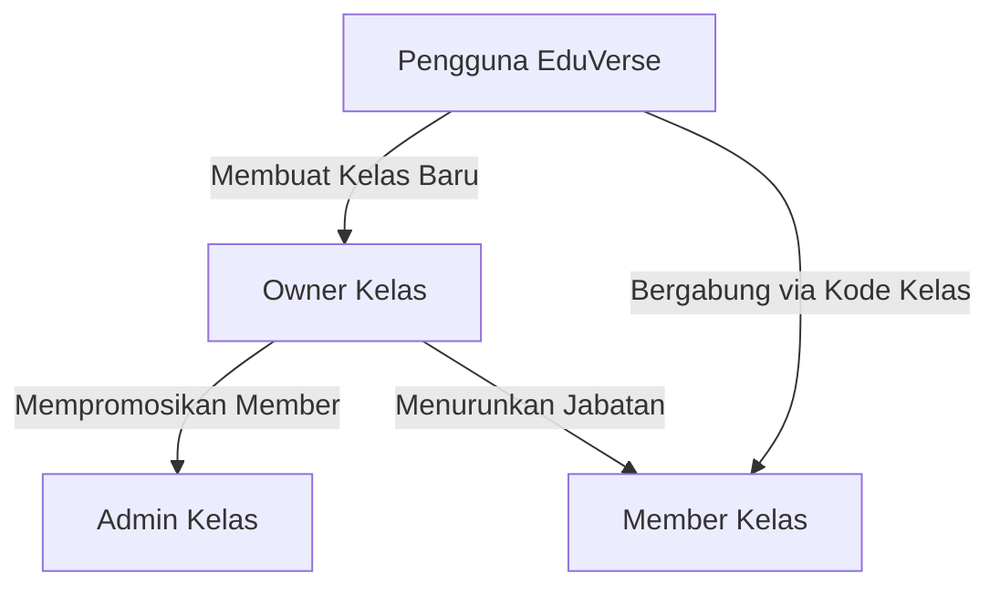
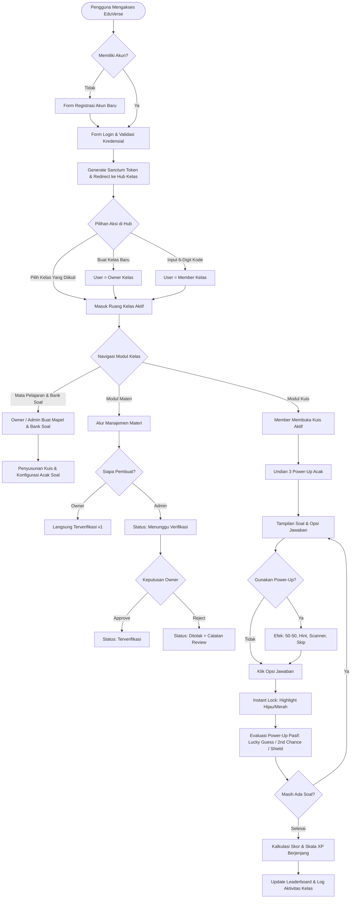
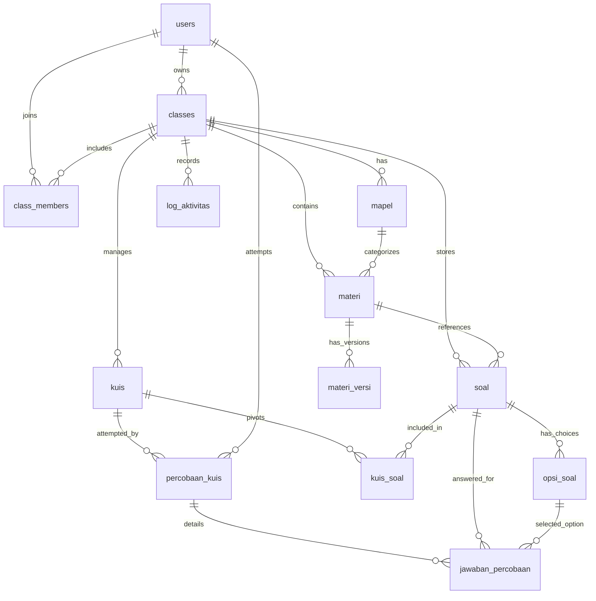
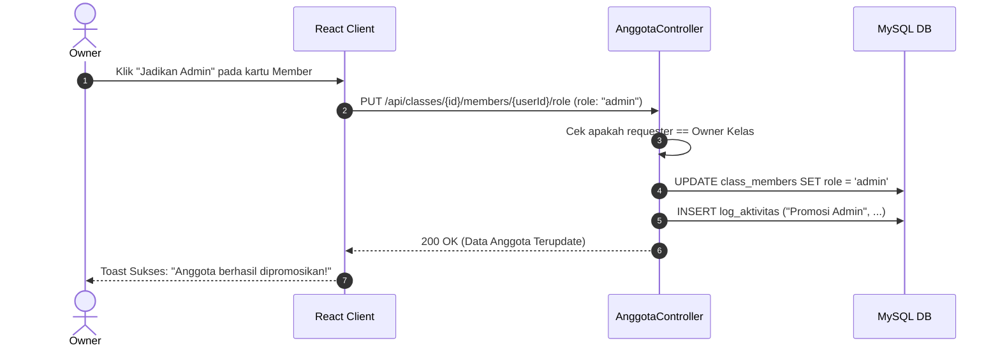
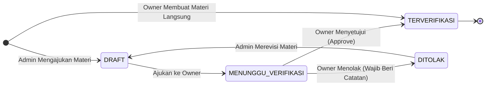

# DOKUMENTASI LENGKAP & PANDUAN PENGGUNA APLIKASI EDUVERSE

---

## HALAMAN SAMPUL

**Nama Aplikasi**: EduVerse (Platform Pembelajaran Berbasis Kelas & Gamifikasi Kuis Interaktif)  
**Kategori Proyek**: Web Application (Decoupled Fullstack Architecture)  
**Versi Aplikasi**: v2.0 (Production Release 2026)  
**Arsitektur Sistem**: Frontend Single Page Application (React + Vite) & Backend RESTful API (Laravel 11 + Laravel Sanctum)  
**Basis Data**: MySQL Relational Database (12 Tabel Berelasi)  
**Status Dokumen**: Final & Terverifikasi  
**Tanggal Penyusunan**: 7 September 2026  
**Penyusun**: Tim Pengembang EduVerse (Advanced Fullstack Engineering Team)  

---

## KATA PENGANTAR

Puji dan syukur kami panjatkan ke hadirat Tuhan Yang Maha Esa atas rahmat dan karunia-Nya sehingga dokumen panduan dan dokumentasi teknis sistem aplikasi **EduVerse** ini dapat diselesaikan dengan baik dan terstruktur.

Dokumen ini disusun sebagai panduan menyeluruh (*comprehensive handbook*) yang mengulas seluruh aspek aplikasi EduVerse, mulai dari latar belakang dan arsitektur sistem, skema basis data, instalasi lingkungan pengembangan, tata kelola akun dan otorisasi peran, hingga panduan teknis operasional fitur-fitur utama seperti kontrol versi materi (*Version Control Material*) serta sistem kuis interaktif dengan gamifikasi *Power-Up* dan *Leaderboard Experience Points* (XP).

Aplikasi EduVerse dikembangkan untuk menjawab kebutuhan platform pembelajaran daring yang mandiri, transparan, dan menarik tanpa keterikatan eksklusif pada satu instansi atau institusi tunggal. Melalui desentralisasi ruang kelas, setiap pengguna memiliki kebebasan untuk mengelola kelasnya sendiri sebagai *Owner*, berkolaborasi dengan *Admin*, atau berpartisipasi aktif sebagai *Member*.

Kami menyadari bahwa penyusunan dokumen ini masih dapat terus disempurnakan seiring berkembangnya inovasi teknologi dan kebutuhan pengguna. Semoga dokumen ini dapat memberikan manfaat nyata, kemudahan implementasi, serta wawasan teknis yang bernilai bagi pengembang, pengajar, maupun pengguna umum.

Jakarta, 7 September 2026  
**Tim Pengembang EduVerse**

---

## UCAPAN TERIMA KASIH

Dalam proses perancangan, pengembangan kode program, hingga penyusunan dokumentasi sistem aplikasi EduVerse, tim pengembang menerima dukungan, arahan, dan kontribusi yang sangat berharga. Oleh karena itu, kami ingin menyampaikan rasa terima kasih dan apresiasi yang tulus kepada:

1. **Dosen Pengampu & Pembimbing Akademik**, atas bimbingan strategis, saran metodologi rekayasa perangkat lunak, serta arahan akademis yang senantiasa memotivasi tim selama pengembangan aplikasi.
2. **Tim Rekayasa Perangkat Lunak (Frontend & Backend Developer)**, yang telah mendedikasikan waktu, logika, dan komitmen tinggi dalam mewujudkan arsitektur sistem yang modular, bersih, dan tangguh (*robust*).
3. **Pengajar, Asisten Praktikum, dan Peserta Uji Coba**, yang telah berperan aktif dalam sesi pengujian antarmuka (*user testing*), memberikan umpan balik substantif terhadap alur verifikasi dua arah pada materi, serta menguji ketepatan kalkulasi sistem kuis bergamifikasi.
4. **Keluarga dan Rekan-Rekan Mahasiswa**, yang tiada henti memberikan dorongan moral dan lingkungan yang kondusif hingga proyek ini berhasil diselesaikan dengan predikat memuaskan.

---

## LEMBAR PENGESAHAN

Dokumen Panduan Teknis & Pengguna Aplikasi **EduVerse** ini telah diperiksa, diuji coba fungsionalitasnya, dan dinyatakan sah serta memenuhi standar mutu dokumentasi perangkat lunak pada:

- **Hari / Tanggal**: Senin, 7 September 2026
- **Judul Proyek**: EduVerse (Platform Pembelajaran Berbasis Kelas & Gamifikasi Kuis)
- **Status Dokumen**: Final & Approved for Production Manual
- **Lingkup Pengujian**: Arsitektur API Backend, Otorisasi Keamanan Multi-Role, Antarmuka Single Page Application, dan Integritas Basis Data MySQL.

Menyetujui dan Mengesahkan,

| Perwakilan Pengembang | Pembimbing / Penanggung Jawab Teknis |
| :---: | :---: |
| <br><br><br>**( Tim Pengembang EduVerse )**<br>Lead Architect & Engineer | <br><br><br>**( Dosen / Koordinator Proyek )**<br>System Supervisor |

---

# DAFTAR ISI

- [Halaman Sampul](#halaman-sampul)
- [Kata Pengantar](#kata-pengantar)
- [Ucapan Terima Kasih](#ucapan-terima-kasih)
- [Lembar Pengesahan](#lembar-pengesahan)
- [Bab 1: Pendahuluan](#bab-1-pendahuluan)
  - [1.1 Latar Belakang & Tujuan Aplikasi](#11-latar-belakang--tujuan-aplikasi)
  - [1.2 Target Pengguna (User Roles)](#12-target-pengguna-user-roles)
  - [1.3 Kebutuhan Sistem (Minimum Hardware & Software Requirement)](#13-kebutuhan-sistem-minimum-hardware--software-requirement)
- [Bab 2: Arsitektur & Perancangan Sistem](#bab-2-arsitektur--perancangan-sistem)
  - [2.1 Alur Kerja Sistem (Business Process)](#21-alur-kerja-sistem-business-process)
  - [2.2 Teknologi (Bahasa Pemrograman, Framework, Database)](#22-teknologi-bahasa-pemrograman-framework-database)
  - [2.3 Perancangan Basis Data (ERD / Struktur Tabel)](#23-perancangan-basis-data-erd--struktur-tabel)
- [Bab 3: Memulai Aplikasi](#bab-3-memulai-aplikasi)
  - [3.1 Cara Akses atau Instalasi (Web/Desktop/Mobile)](#31-cara-akses-atau-instalasi-webdesktopmobile)
  - [3.2 Halaman Utama & Tampilan Antarmuka (UI Overview)](#32-halaman-utama--tampilan-antarmuka-ui-overview)
  - [3.3 Prosedur Registrasi & Pembuatan Akun Baru](#33-prosedur-registrasi--pembuatan-akun-baru)
  - [3.4 Panduan Login dan Logout](#34-panduan-login-dan-logout)
- [Bab 4: Manajemen Akun & Pengaturan (Settings)](#bab-4-manajemen-akun--pengaturan-settings)
  - [4.1 Mengubah Profil Pengguna & Kata Sandi](#41-mengubah-profil-pengguna--kata-sandi)
  - [4.2 Pengaturan Hak Akses (Role Management)](#42-pengaturan-hak-akses-role-management)
  - [4.3 Konfigurasi Umum Aplikasi](#43-konfigurasi-umum-aplikasi)
- [Bab 5: Fitur Utama Aplikasi (Core Features)](#bab-5-fitur-utama-aplikasi-core-features)
  - [5.1 Modul Dashboard & Statistik Kelas](#51-modul-dashboard--statistik-kelas)
  - [5.2 Modul Manajemen Mata Pelajaran & Bank Soal](#52-modul-manajemen-mata-pelajaran--bank-soal)
  - [5.3 Modul Materi Berversi & Pelaksanaan Kuis Interaktif](#53-modul-materi-berversi--pelaksanaan-kuis-interaktif)
  - [5.4 Modul Leaderboard, Rekapitulasi Skor & Audit Log](#54-modul-leaderboard-rekapitulasi-skor--audit-log)
- [Bab 6: Panduan Lanjutan (Advanced Features)](#bab-6-panduan-lanjutan-advanced-features)
  - [6.1 Integrasi dengan Sistem Lain](#61-integrasi-dengan-sistem-lain)
  - [6.2 Pencadangan & Pemulihan Data (Backup & Restore)](#62-pencadangan--pemulihan-data-backup--restore)
- [Bab 7: Pemecahan Masalah (Troubleshooting)](#bab-7-pemecahan-masalah-troubleshooting)
- [Lampiran](#lampiran)
  - [Lampiran 1: Matriks Hak Akses Peran Kelas (Role & Permission Matrix)](#lampiran-1-matriks-hak-akses-peran-kelas-role--permission-matrix)
  - [Lampiran 2: Format Generator Soal AI (AI Prompt Template)](#lampiran-2-format-generator-soal-ai-ai-prompt-template)
  - [Lampiran 3: Katalog Endpoint REST API EduVerse](#lampiran-3-katalog-endpoint-rest-api-eduverse)
  - [Lampiran 4: Dokumentasi Kamus Data Skema Basis Data](#lampiran-4-dokumentasi-kamus-data-skema-basis-data)

---

# BAB 1: PENDAHULUAN

### 1.1 Latar Belakang & Tujuan Aplikasi

Perkembangan teknologi informasi telah merevolusi ekosistem pembelajaran modern, menuntut platform edukasi yang tidak sekadar berfungsi sebagai tempat penyimpanan materi statis, melainkan sebagai wadah kolaborasi aktif, transparan, dan interaktif. Banyak platform pembelajaran (*Learning Management System* / LMS) konvensional memiliki birokrasi berjenjang yang kaku, di mana pembuatan dan pengelolaan ruang belajar terpusat sepenuhnya pada administrator sekolah atau institusi tertentu.

**EduVerse** dirancang untuk mendobrak batasan tersebut melalui pendekatan **desentralisasi berbasis kelas mandiri**. Pada sistem ini, setiap pengguna yang terdaftar berhak membuat ruang kelas belajarnya sendiri, mengundang anggota secara instan menggunakan 6-karakter Kode Kelas unik, serta mengelola pembagian peran pengajar dan peserta secara independen di dalam kelas tersebut.

Selain fleksibilitas struktur kelas, EduVerse memecahkan dua permasalahan mendasar dalam pembelajaran digital:
1. **Integritas dan Validasi Konten Pembelajaran**: Pada kelas kolaboratif, penambahan atau perubahan materi oleh asisten/pengajar pendamping rentan menimbulkan inkonsistensi. EduVerse menerapkan mekanisme **Version Control Materi** dengan alur *review side-by-side* dan verifikasi dua arah (Owner - Admin), sehingga setiap perubahan memiliki rekam jejak revisi yang dapat diaudit.
2. **Keterlibatan (*Engagement*) dan Motivasi Belajar Peserta**: Model ujian atau kuis konvensional seringkali terasa monoton dan menegangkan. EduVerse mengintegrasikan konsep **Gamifikasi Modern** ke dalam modul kuis, mencakup penguncian jawaban instan (*Instant Lock & Instant Feedback*), undian sistem 8 variasi *Power-Up* (seperti *Lucky Guess, Second Chance, Shield, Fifty-Fifty*), serta kalkulasi skor berbasis *Experience Points* (XP) dengan kurva anti-farming yang dinamis.

Tujuan strategis aplikasi EduVerse adalah:
- Menyediakan platform belajar kolaboratif yang fleksibel dan dapat diakses dengan mudah oleh siapa saja tanpa terikat institusi formal.
- Menjamin akurasi dan kualitas konten belajar melalui sistem audit versi materi yang transparan.
- Meningkatkan retensi pemahaman belajar pengguna melalui evaluasi kuis adaptif dan kompetisi sehat pada papan peringkat kelas (*Class Leaderboard*).

---

### 1.2 Target Pengguna (User Roles)

Sistem EduVerse menerapkan konsep **Role Berbasis Konteks Kelas (Class-Scoped Role Management)**. Hak akses pengguna tidak bersifat global di tingkat aplikasi, melainkan terikat pada entitas kelas (`class_members`). Seorang pengguna dapat memiliki peran sebagai *Owner* di kelas yang diciptakannya, sekaligus menjadi *Member* di kelas lain yang diikutinya.

Terdapat tiga peran (*roles*) utama dalam ekosistem EduVerse:



| Peran (Role) | Definisi & Posisi | Tanggung Jawab & Hak Akses Utama |
| :--- | :--- | :--- |
| **Owner** | Pemilik dan inisiator utama ruang kelas (otomatis saat membuat kelas). | - Mengubah informasi nama, deskripsi, dan cover kelas.<br>- Meregenerasi 6-karakter Kode Kelas unik.<br>- Mempromosikan Member menjadi Admin atau menurunkannya kembali (*Demote*).<br>- Mengeluarkan anggota dari kelas (*Kick Member*).<br>- Menyetujui (*Approve*) atau Menolak (*Reject*) draf materi baru beserta catatan penolakan.<br>- Membuat materi terbit langsung (*Direct Publish*).<br>- Menghapus ruang kelas secara permanen. |
| **Admin** | Pengajar pembantu atau asisten kelas yang ditunjuk langsung oleh Owner. | - Menambahkan dan mengedit Mata Pelajaran (*Mapel*).<br>- Mengajukan draf materi baru atau revisi versi materi (masuk status `menunggu_verifikasi`).<br>- Mengelola Bank Soal kelas (input manual dan generator AI).<br>- Merancang dan menerbitkan Kuis baru ke dalam kelas. |
| **Member** | Peserta belajar atau siswa yang bergabung menggunakan Kode Kelas. | - Mengakses beranda dan pengumuman kelas.<br>- Membaca seluruh materi pembelajaran yang telah berstatus `terverifikasi`.<br>- Melihat riwayat versi materi (*Version History*).<br>- Mengikuti kuis interaktif dan memanfaatkan sistem *Power-Up*.<br>- Melihat akumulasi perolehan XP dan memantau peringkat pada Leaderboard Kelas. |

---

### 1.3 Kebutuhan Sistem (Minimum Hardware & Software Requirement)

Untuk menjamin performa aplikasi berjalan optimal, responsif, dan stabil, berikut adalah spesifikasi kebutuhan perangkat keras dan perangkat lunak minimum yang direkomendasikan:

#### Kebutuhan Perangkat Keras (Hardware Requirements):
- **Lingkungan Klien (End-User Browser)**:
  - Processor: Intel Core i3 / AMD Ryzen 3 (Dual Core 2.0 GHz) atau prosesor mobile sekelas.
  - RAM: Minimal 4 GB.
  - Resolusi Layar: Minimal 360 x 640 piksel (Mobile Responsive) hingga 1920 x 1080 piksel (Desktop).
  - Koneksi Internet: Kecepatan minimal 1 Mbps untuk latensi REST API yang lancar.
- **Lingkungan Server (Development & Deployment)**:
  - Processor: 2 vCPU (Quad Core 2.5 GHz direkomendasikan).
  - RAM: Minimal 2 GB (4 GB atau lebih disarankan untuk build Vite & PHP-FPM).
  - Penyimpanan: Free disk space minimal 1 GB untuk kode sumber, dependensi `node_modules`, `vendor`, log, dan database.

#### Kebutuhan Perangkat Lunak (Software Requirements):
- **Sisi Klien (Client-Side)**:
  - Web Browser: Google Chrome (v110+), Mozilla Firefox (v110+), Microsoft Edge (v110+), atau Apple Safari (v16+).
  - JavaScript engine aktif (ES6+ support).
- **Sisi Server (Server-Side Backend)**:
  - Bahasa Pemrograman: PHP v8.2 atau v8.3.
  - Ekstensi PHP Wajib: OpenSSL, PDO, PDO_MySQL, Mbstring, Tokenizer, XML, Ctype, JSON, cURL, BCMath.
  - Framework Backend: Laravel 11.x.
  - Otentikasi: Laravel Sanctum (Stateful & Bearer Token Authentication).
  - Package Manager: Composer v2.5+.
- **Sisi Server (Server-Side Frontend Build)**:
  - Runtime: Node.js v18.x atau v20.x (LTS).
  - Package Manager: npm v9.x+ atau pnpm v8.x+.
  - Build Tool: Vite v5.x.
  - Framework Frontend: React v18.x.
- **Sistem Manajemen Basis Data (DBMS)**:
  - MySQL Server v8.0+ atau MariaDB v10.5+.
  - Utilitas Ekspor/Impor: `mysqldump` & `mysql client`.

---

# BAB 2: ARSITEKTUR & PERANCANGAN SISTEM

### 2.1 Alur Kerja Sistem (Business Process)

Aplikasi EduVerse mengadopsi arsitektur terpisah (*Decoupled Client-Server Architecture*). Sisi klien (React SPA) berkomunikasi dengan sisi peladen (Laravel API) murni menggunakan protokol HTTP/HTTPS dengan format pertukaran data standar JSON.

Diagram alir berikut mengilustrasikan proses bisnis menyeluruh pada ekosistem EduVerse:



---

### 2.2 Teknologi (Bahasa Pemrograman, Framework, Database)

Pengembangan sistem EduVerse menerapkan prinsip *Separation of Concerns* (SoC) dengan susunan *tech-stack* modern:

```
+-----------------------------------------------------------------------+
|                       FRONTEND LAYER (React SPA)                     |
|  - React 18 (Functional Components, Hooks: useState, useEffect, etc.)  |
|  - React Router DOM v6 (Nested Routes, Dynamic Params /class/:classId)|
|  - Vite Build System (Hot Module Replacement, Fast Asset Bundling)    |
|  - Vanilla CSS & Lucide Icons (Design Tokens, Glassmorphism, Theme)   |
|  - AppStateContext (Global Session State, Active Class, XP Sync)      |
+-----------------------------------------------------------------------+
                                  │
                                  │ HTTP / JSON (Bearer Token Sanctum)
                                  ▼
+-----------------------------------------------------------------------+
|                    BACKEND REST API LAYER (Laravel 11)                |
|  - Laravel 11 Kernel & Controllers (RESTful Routing)                  |
|  - Laravel Sanctum (Token Auth, Stateful API Guards)                  |
|  - CekPeranKelas Middleware & Gate Policies (Multi-Role Enforcement)  |
|  - Eloquent ORM (Relationships, Eager Loading, Query Scopes)          |
|  - JSON API Formatter: { success: true, data: ..., message: ... }     |
+-----------------------------------------------------------------------+
                                  │
                                  │ PDO Connection (MySQL Driver)
                                  ▼
+-----------------------------------------------------------------------+
|                     DATABASE LAYER (MySQL Server 8.0)                 |
|  - Relational Schema (12 Master & Transactional Tables)               |
|  - Foreign Key Constraints & Cascade/Set-Null Referentials            |
|  - Indexed Unique Keys (username, email, kode_kelas)                  |
+-----------------------------------------------------------------------+
```

1. **Frontend Client (React SPA)**:
   - **Komponen Fungsional & Hook**: Menggunakan kode modular berbasis fungsi (`useAppState`, `useState`, `useMemo`, `useNavigate`).
   - **Desain Antarmuka Glassmorphism**: Visual modern tanpa ketergantungan utility framework eksternal berlebih, memadukan transparansi latar belakang (`backdrop-filter`), bayangan halus (*box-shadow*), dan aksen warna tematik per mata pelajaran.
   - **Routing Dinamis**: Mengelola navigasi halaman tunggal tanpa muat ulang (*full reload*), mencakup parameter URL seperti `/class/:classId/materi`, `/class/:classId/quiz`, dan `/class/:classId/members`.
2. **Backend API (Laravel 11)**:
   - **Otentikasi Aman Sanctum**: Setiap permintaan dilindungi dengan header `Authorization: Bearer <token>`.
   - **Kebijakan & Middleware Keamanan**: Melalui middleware `CekPeranKelas` dan metode `$kelas->hasUser($user)`, sistem memastikan pencegahan kebocoran data (*data leak*) lintas ruang kelas. Pengguna non-anggota secara ketat diblokir dengan kode status `403 Forbidden`.
   - **Standarisasi Respon**: Seluruh respons API dibungkus seragam:
     ```json
     {
       "success": true,
       "message": "Data berhasil dimuat",
       "data": { ... }
     }
     ```
3. **Database Server (MySQL 8.0)**:
   - Menjamin integritas referensial data (*ACID properties*), relasi satu-ke-banyak (*one-to-many*), dan banyak-ke-banyak (*many-to-many*).

---

### 2.3 Perancangan Basis Data (ERD / Struktur Tabel)

Struktur basis data EduVerse terdiri dari 12 tabel yang saling terhubung secara terstruktur:



#### Ringkasan Definisi 12 Tabel Utama:

1. **`users`**: Menyimpan kredensial otentikasi akun global.
   - Kolom: `id`, `name`, `username` (unique), `email` (unique), `password`, `foto_profil`, `bio`, `created_at`, `updated_at`.
2. **`classes`**: Menyimpan entitas ruang kelas belajar.
   - Kolom: `id`, `nama`, `deskripsi`, `kode_kelas` (unique, 6 karakter alfanumerik), `owner_id` (FK `users`), `created_at`, `updated_at`.
3. **`class_members`**: Menyimpan asosiasi keanggotaan pengguna dan perannya di dalam suatu kelas.
   - Kolom: `id`, `kelas_id` (FK `classes`), `user_id` (FK `users`), `role` (enum: `owner`, `admin`, `member`), `created_at`, `updated_at`.
4. **`mapel`**: Daftar mata pelajaran di dalam kelas beserta kode singkatan dan palet warna visual.
   - Kolom: `id`, `kelas_id` (FK `classes`), `kode` (varchar 10), `nama` (varchar 100), `warna` (varchar 50), `created_at`, `updated_at`.
5. **`materi`**: Entitas induk materi pembelajaran.
   - Kolom: `id`, `kelas_id` (FK `classes`), `judul` (varchar 255), `mapel_id` (FK `mapel`), `versi_aktif_id` (FK `materi_versi` nullable), `dibuat_oleh` (FK `users`), `created_at`, `updated_at`.
6. **`materi_versi`**: Rekam jejak versi isi materi untuk mendukung *Version Control*.
   - Kolom: `id`, `materi_id` (FK `materi`), `nomor_versi` (int), `isi` (longtext), `status` (enum: `draft`, `menunggu_verifikasi`, `terverifikasi`, `ditolak`), `dibuat_oleh` (FK `users`), `ditinjau_oleh` (FK `users` nullable), `catatan_review` (text nullable), `created_at`, `updated_at`.
7. **`soal`**: Bank soal kelas yang dapat digunakan kembali (*reusable question bank*).
   - Kolom: `id`, `kelas_id` (FK `classes`), `pertanyaan` (text), `jenis_soal` (enum: `pilihan_ganda`), `pembahasan` (text nullable), `materi_id` (FK `materi` nullable), `dibuat_oleh` (FK `users`), `created_at`, `updated_at`.
8. **`opsi_soal`**: Pilihan jawaban pada setiap butir soal (opsi A sampai E).
   - Kolom: `id`, `soal_id` (FK `soal`), `teks_opsi` (text), `benar` (boolean), `urutan` (int), `created_at`, `updated_at`.
9. **`kuis`**: Entitas paket kuis atau evaluasi belajar.
   - Kolom: `id`, `kelas_id` (FK `classes`), `judul` (varchar 255), `deskripsi` (text nullable), `batas_waktu` (int menit), `jumlah_soal` (int), `acak_soal` (boolean), `acak_opsi` (boolean), `status_aktif` (boolean), `dibuat_oleh` (FK `users`), `created_at`, `updated_at`.
10. **`kuis_soal`**: Tabel pivot pemetaan butir soal yang diikutsertakan dalam paket kuis.
    - Kolom: `id`, `kuis_id` (FK `kuis`), `soal_id` (FK `soal`), `urutan` (int), `created_at`, `updated_at`.
11. **`percobaan_kuis`**: Rekap sesi pengerjaan kuis oleh seorang anggota kelas.
    - Kolom: `id`, `kuis_id` (FK `kuis`), `user_id` (FK `users`), `percobaan_ke` (int), `skor` (int), `xp_didapat` (int), `power_up_terpakai` (json nullable), `mulai_pada` (datetime), `selesai_pada` (datetime nullable), `created_at`, `updated_at`.
12. **`jawaban_percobaan`**: Detail rekaman pilihan jawaban pengguna per butir soal pada suatu percobaan kuis.
    - Kolom: `id`, `percobaan_id` (FK `percobaan_kuis`), `soal_id` (FK `soal`), `opsi_dipilih_id` (FK `opsi_soal` nullable), `benar` (boolean), `created_at`, `updated_at`.
13. **`log_aktivitas`**: Audit log pencatatan aksi penting di kelas (pembuatan materi, verifikasi, kuis baru, pergantian anggota).
    - Kolom: `id`, `kelas_id` (FK `classes`), `user_id` (FK `users`), `aksi` (varchar 100), `deskripsi` (text), `created_at`, `updated_at`.

---

# BAB 3: MEMULAI APLIKASI

### 3.1 Cara Akses atau Instalasi (Web/Desktop/Mobile)

EduVerse dirancang sebagai aplikasi web berbasis peramban modern yang responsif (*cross-device responsive web app*). Aplikasi dapat diakses melalui laptop/desktop, tablet, maupun ponsel pintar tanpa memerlukan instalasi aplikasi pihak ketiga dari toko aplikasi.

#### Panduan Instalasi Lingkungan Pengembang (Local Setup):

##### Langkah 1: Persiapan Basis Data (MySQL)
Pastikan service MySQL telah berjalan (misal menggunakan XAMPP atau MySQL Native), kemudian buat database baru:
```sql
CREATE DATABASE eduverse_db CHARACTER SET utf8mb4 COLLATE utf8mb4_unicode_ci;
```

##### Langkah 2: Instalasi & Konfigurasi Backend (Laravel API)
Buka terminal dan jalankan urutan instruksi berikut pada direktori `Eduverse-Backend`:
```bash
cd Eduverse-Backend
composer install
cp .env.example .env
php artisan key:generate
```
Sesuaikan konfigurasi koneksi basis data pada berkas `.env`:
```ini
DB_CONNECTION=mysql
DB_HOST=127.0.0.1
DB_PORT=3306
DB_DATABASE=eduverse_db
DB_USERNAME=root
DB_PASSWORD=

SANCTUM_STATEFUL_DOMAINS=localhost:5173,127.0.0.1:5173
SESSION_DOMAIN=localhost
```
Jalankan migrasi skema tabel dan seed data awal:
```bash
php artisan migrate --seed
php artisan serve --port=8000
```
*API peladen akan aktif dan siap menerima permintaan pada `http://127.0.0.1:8000`.*

##### Langkah 3: Instalasi & Eksekusi Frontend (React Vite)
Buka jendela terminal baru, masuk ke direktori `Eduverse-Frontend`, lalu jalankan:
```bash
cd Eduverse-Frontend
npm install
npm run dev
```
*Aplikasi frontend klien akan aktif pada `http://localhost:5173`.*

---

### 3.2 Halaman Utama & Tampilan Antarmuka (UI Overview)

Antarmuka EduVerse dirancang secara ergonomis dengan hierarki visual yang jelas:

1. **Hub Kelas Utama (`/`)**:
   - Area selamat datang dengan kartu profil ringkas pengguna.
   - Tombol tindakan utama: **+ Buat Kelas Baru** dan **Gabung Kelas** (input kode kelas).
   - Daftar kartu kelas yang diikuti pengguna, dilengkapi label peran pengguna (*Owner / Admin / Member*), jumlah anggota, dan akses cepat sekali klik.
2. **Topbar & Navigasi Header**:
   - Menampilkan logo EduVerse, indikator level dan progress bar XP pengguna saat ini, ikon notifikasi, dan avatar pengguna.
   - Mengklik avatar membuka dropdown profil untuk menuju ke Pengaturan Akun atau tombol Logout.
3. **Menu Navigasi Ruang Kelas (`/class/:classId/*`)**:
   - **Beranda**: Menampilkan banner kelas, statistik kuantitatif, papan pengumuman, dan log aktivitas terbaru.
   - **Materi**: Katalog materi belajar yang dikelompokkan berdasarkan mata pelajaran.
   - **Kuis**: Daftar kuis evaluasi yang tersedia beserta status pengerjaan pengguna.
   - **Leaderboard**: Peringkat keaktifan anggota kelas berdasarkan perolehan XP.
   - **Anggota**: Daftar profil anggota dan pengelola kelas.
   - **Pengaturan Kelas** *(Khusus Owner)*: Konfigurasi nama, kode kelas, dan hak akses kelas.

---

### 3.3 Prosedur Registrasi & Pembuatan Akun Baru

Untuk pengguna yang belum memiliki akun, langkah-langkah pendaftaran adalah sebagai berikut:
1. Buka peramban dan navigasikan ke alamat URL `/register`.
2. Masukkan informasi formulir pendaftaran:
   - **Nama Lengkap**: Masukkan nama asli yang akan tampil pada sertifikasi dan leaderboard.
   - **Username**: Kombinasi karakter unik tanpa spasi (misal: `alif_dev`).
   - **Alamat Email**: Email aktif yang valid untuk kebutuhan identifikasi.
   - **Password**: Kata sandi pengaman dengan panjang minimal 8 karakter.
   - **Konfirmasi Password**: Masukkan ulang kata sandi yang sama.
   - **Bio & Foto Profil**: Informasi opsional untuk melengkapi identitas pengguna.
3. Klik tombol **Daftar Akun**.
4. Sistem backend melakukan validasi integritas data (`unique:users,email`, `unique:users,username`). Jika valid, akun akan dibuat, token autentikasi Sanctum langsung diterbitkan, dan pengguna otomatis dialihkan ke Hub Kelas Utama.

---

### 3.4 Panduan Login dan Logout

#### Prosedur Masuk (Login):
1. Buka halaman `/login`.
2. Masukkan kombinasi **Email atau Username** dan **Kata Sandi**.
3. Klik tombol **Masuk ke EduVerse**.
4. Sistem memverifikasi kredensial melalui endpoint `POST /api/login`. Jika terverifikasi, token disimpan pada penyimpanan aman klien, state pengguna dimuat, dan aplikasi mengarahkan ke halaman Hub Kelas.

#### Prosedur Keluar (Logout) & Keamanan Data (Aturan #12):
1. Klik foto profil pengguna di sudut kanan atas Topbar.
2. Pilih opsi **Keluar** (Logout).
3. **Pembersihan Bersih (*Clean Slate Flush*)**: Sistem secara otomatis memanggil endpoint `POST /api/logout` untuk mencabut (*revoke*) token di basis data, kemudian seketika menghapus seluruh token, cache lokal, dan state React global. Hal ini menjamin tidak ada riwayat data pengguna lama yang tertinggal saat sesi login berganti.

---

# BAB 4: MANAJEMEN AKUN & PENGATURAN (SETTINGS)

### 4.1 Mengubah Profil Pengguna & Kata Sandi

Pengguna dapat memodifikasi profil akun global mereka melalui halaman **Pengaturan Akun** (`/settings`):
- **Pembaruan Informasi Umum**: Mengubah nama tampilan (*display name*) dan deskripsi biografi pengguna.
- **Unggah & Potong Foto Profil (*Image Cropper*)**: Sistem dilengkapi modul pemotong gambar interaktif (`ImageCropperModal.jsx`). Pengguna dapat mengunggah foto dalam format JPG/PNG/WebP, menyesuaikan rasio lingkaran, dan menyimpannya secara rapi ke media storage backend.
- **Penggantian Kata Sandi**: Demi alasan keamanan, penggantian kata sandi mewajibkan input kata sandi saat ini (*current password*) sebelum memasukkan kata sandi baru (minimal 8 karakter).

---

### 4.2 Pengaturan Hak Akses (Role Management)

Pengaturan peran anggota dikendalikan sepenuhnya oleh **Owner Kelas** melalui halaman **Manajemen Anggota** (`/class/:classId/members`):



1. **Promosi Menjadi Admin**: Owner dapat menaikkan status Member menjadi Admin. Admin memiliki wewenang membuat mata pelajaran, mengajukan draf materi, membuat bank soal, dan menyusun kuis.
2. **Penurunan Jabatan (*Demote*)**: Owner dapat mengembalikan peran Admin menjadi Member biasa.
3. **Keluarkan Anggota (*Kick Member*)**: Owner berhak memberhentikan keanggotaan seseorang dari kelas. Pengguna yang dikeluarkan kehilangan akses ke kelas tersebut seketika.

---

### 4.3 Konfigurasi Umum Aplikasi

Pemilik kelas (*Owner*) memiliki akses eksklusif ke menu **Pengaturan Kelas** (`/class/:classId/edit-info`):
- **Ubah Informasi Dasar Kelas**: Memperbarui Nama Kelas dan Deskripsi Kelas kapan saja tanpa merusak relasi data yang ada.
- **Regenerate Kode Kelas (6-Karakter Unik)**: Jika kode kelas lama telah tersebar secara tidak sengaja, Owner dapat menekan tombol **Acak Kode Baru**. Sistem akan menghasilkan kode acak 6-karakter baru yang unik. Kode lama seketika tidak aktif, namun anggota yang sudah bergabung tetap berada di dalam kelas.
- **Hapus Kelas Permanen**: Owner dapat menghapus ruang kelas beserta seluruh materi, kuis, dan data nilai di dalamnya. Tindakan ini dilindungi konfirmasi ganda karena bersifat destruktif permanen.

---

# BAB 5: FITUR UTAMA APLIKASI (CORE FEATURES)

### 5.1 Modul Dashboard & Statistik Kelas

Modul Beranda Kelas (`/class/:classId`) menyajikan rangkuman komprehensif terkait kondisi kelas dalam satu tampilan terpadu:
- **Kartu Statistik Cepat (*Quick Metrics*)**:
  - Total Materi Pembelajaran yang telah terbit.
  - Jumlah Kuis Aktif yang siap dikerjakan.
  - Total Anggota Kelas yang terdaftar.
  - Peringkat dan Akumulasi XP Pengguna di kelas tersebut.
- **Papan Pengumuman Kelas**: Tempat Owner dan Admin menyematkan arahan belajar, jadwal pertemuan, atau batas waktu tugas.
- **Log Audit Aktivitas Terbaru**: Riwayat kronologis yang mencatat aktivitas penting (misal: penambahan materi baru, verifikasi materi, penerbitan kuis) sehingga seluruh anggota mengetahui perkembangan kelas terkini.

---

### 5.2 Modul Manajemen Mata Pelajaran & Bank Soal

Modul ini diakses melalui bilah navigasi profil kelas pada tab `add_subject` dan `add_quiz`:

1. **Manajemen Mata Pelajaran (Mapel)**:
   - Pengelola kelas dapat membuat mata pelajaran baru dengan menentukan Nama Mapel, Kode Singkat (misal: `WEB-01`, `KIM-10`), dan gradien warna penanda visual untuk mempermudah identifikasi tema kartu materi.
2. **Bank Soal Kelas (*Reusable Question Bank*)**:
   - Soal-soal yang dibuat tersimpan di basis data kelas dan dapat digunakan kembali pada berbagai paket kuis yang berbeda.
   - **Metode Input Soal Manual**:
     - Memasukkan teks pertanyaan dan penjelasan/pembahasan soal.
     - Menyusun pilihan jawaban A sampai E (fleksibel mulai dari 2 pilihan hingga maksimal 5 pilihan) serta menandai satu opsi yang benar.
   - **Metode Generator Soal Cerdas Berbasis AI (*AI Prompt Generator*)**:
     - Sistem menyediakan tombol **Salin Prompt AI Standar**.
     - Pengguna cukup menempelkan draf teks soal hasil generate AI ke dalam kolom teks sistem.
     - Mesin *parser* EduVerse secara cerdas membaca pola teks, membedah butir nomor soal, mendeteksi opsi pilihan A-E, mengunci kunci jawaban, dan mengekstrak pembahasan secara instan ke dalam antarmuka pratinjau (*live preview*) sebelum disimpan permanen.

---

### 5.3 Modul Materi Berversi & Pelaksanaan Kuis Interaktif

Dua fitur utama yang menjadi keunggulan mendasar EduVerse adalah:

#### A. Kontrol Versi Materi (*Version Control Material*)
Materi pembelajaran di EduVerse tidak dapat diubah sembarangan tanpa rekam jejak. Sistem mengimplementasikan siklus verifikasi:



- **Tampilan Komparator 2 Kolom (*Side-by-Side Review*)**: Saat meninjau materi versi baru, antarmuka menyajikan teks versi terdahulu di sisi kiri dan rancangan draf versi baru di sisi kanan, memudahkan Owner menemukan revisi perubahan.
- **Dropdown Riwayat Versi**: Member dapat memilih dan membaca arsip materi versi sebelumnya untuk mempelajari perkembangan konten.

#### B. Pelaksanaan Kuis Gamifikasi Interaktif (`QuizPlayPage.jsx`)
Sesi pengerjaan kuis dirancang interaktif menyerupai game edukasi:

1. **Pengundian Power-Up Awal (*Power-Up Raffle Spin*)**:
   Sebelum soal pertama dibuka, sistem mengundi **3 Power-Up acak** dari total 8 variasi untuk dibawa pemain ke arena kuis.
2. **Daftar 8 Varian Power-Up EduVerse**:
   - **Hint (Petunjuk)**: Menampilkan kalimat bantuan/kata kunci pembahasan soal.
   - **Fifty-Fifty (50:50)**: Mengeliminasi dua pilihan jawaban salah secara acak.
   - **Answer Scanner**: Menganalisis dan menampilkan persentase kemungkinan jawaban benar.
   - **Skip Question**: Melewati butir soal yang dianggap terlalu rumit tanpa pengurangan nilai.
   - **Kotak Misteri**: Memberikan efek kejutan acak (Hint, 50:50, Skip, atau Bonus +15 XP instan).
   - **Lucky Guess**: Power-up pasif yang memberikan peluang keberuntungan 25-30% mengubah jawaban salah menjadi jawaban benar saat dikunci.
   - **Second Chance**: Power-up pasif yang memberi kesempatan memilih ulang satu kali jika pilihan pertama salah.
   - **Shield**: Power-up proteksi yang menjaga skor agar tidak berkurang ketika pengguna menjawab salah.
3. **Mekanisme Kunci Instan (*Instant Lock & Feedback*)**:
   - Memilih opsi langsung mengunci jawaban tanpa tombol submit tambahan.
   - Opsi terpilih langsung berubah warna: **Hijau Neon** (Benar) atau **Merah Crimson** (Salah). Jika salah, jawaban yang benar otomatis disorot hijau agar pengguna langsung belajar dari kesalahannya.
   - Jeda visual terukur ~1.5 detik sebelum otomatis beralih ke soal berikutnya.

---

### 5.4 Modul Leaderboard, Rekapitulasi Skor & Audit Log

Modul ini bertanggung jawab atas transparansi evaluasi, rekaman histori aktivitas, serta ekspor pelaporan:

1. **Papan Peringkat Kelas (*Class Leaderboard*)**:
   - Menampilkan urutan prestasi seluruh anggota kelas berdasarkan akumulasi total **Experience Points (XP)**.
   - Tiga peringkat teratas diberikan mahkota visual (*Gold, Silver, Bronze Badge*).
2. **Skala Perolehan XP Berjenjang (*Anti-Farming Exponential Scale*)**:
   - **Percobaan Ke-1**: Mendapatkan **100% XP Penuh** sesuai performa skor.
   - **Percobaan Ke-2**: Mendapatkan **50% XP Tambahan** untuk mengapresiasi upaya remedial belajar.
   - **Percobaan Ke-3 dan seterusnya**: **0% XP Tambahan**. Skor tetap tercatat di histori nilai, namun tidak menambah XP kelas untuk mencegah eksploitasi pengulangan soal (*farming XP*).
3. **Rekapitulasi Nilai & Laporan Log Aktivitas**:
   - Detail pengerjaan tersimpan di tabel `percobaan_kuis` dan `jawaban_percobaan`, mencakup lama durasi pengerjaan, skor angka, dan daftar power-up yang diaktifkan.
   - Data riwayat evaluasi dan audit log dapat ditinjau langsung oleh Owner/Admin untuk evaluasi perkembangan belajar kelas.

---

# BAB 6: PANDUAN LANJUTAN (ADVANCED FEATURES)

### 6.1 Integrasi dengan Sistem Lain

EduVerse dibangun dengan pendekatan *API-First Architecture* yang memudahkan integrasi dengan aplikasi eksternal, bot otomatisasi (misal: Telegram/Discord webhook), atau sistem akademik induk sekolah:
- **Protokol Standar**: RESTful HTTP dengan pertukaran data JSON.
- **Autentikasi Integrasi**: Menggunakan *Personal Access Tokens* (Laravel Sanctum) melalui header:
  ```http
  Authorization: Bearer <access_token>
  Accept: application/json
  Content-Type: application/json
  ```
- **Webhook & Event Ready**: Arsitektur controller Laravel dapat memicu Event/Listener untuk mengekspor data kuis atau log kelas ke sistem eksternal secara asinkron.

---

### 6.2 Pencadangan & Pemulihan Data (Backup & Restore)

Untuk menjamin ketersediaan data (*High Availability*) dan mitigasi bencana (*Disaster Recovery*), pengelola peladen dapat menerapkan prosedur rutin berikut:

#### 1. Pencadangan Basis Data (*Database Backup*):
Gunakan perintah `mysqldump` terjadwal (misal via Cron Job harian):
```bash
mysqldump -u root -p eduverse_db --single-transaction --quick --lock-tables=false > backup_eduverse_$(date +%Y%m%d_%H%M%S).sql
```

#### 2. Pencadangan Berkas Media (*Media & Uploads Backup*):
Arsipkan folder penyimpanan publik yang memuat foto avatar pengguna dan media materi:
```bash
tar -czvf media_eduverse_$(date +%Y%m%d).tar.gz Eduverse-Backend/storage/app/public/
```

#### 3. Pemulihan Data (*Database Restore*):
Untuk mengembalikan sistem ke titik pemulihan tertentu:
```bash
mysql -u root -p eduverse_db < backup_eduverse_20260907_120000.sql
```

---

# BAB 7: PEMECAHAN MASALAH (TROUBLESHOOTING)

Tabel berikut menyajikan ringkasan kendala teknis umum beserta solusi penanganannya:

| Kode / Gejala Kendala | Kemungkinan Penyebab | Langkah Solusi & Pemulihan |
| :--- | :--- | :--- |
| **Error 401 Unauthorized** | Token Sanctum telah kedaluwarsa atau sesi login tidak terbaca di header. | Lakukan **Logout** lalu **Login kembali**. Sistem akan membersihkan token lama dan membuat token baru yang valid. |
| **Error 403 Forbidden** | Akun belum terdaftar sebagai anggota kelas, atau mencoba akses fitur Owner/Admin tanpa hak akses. | Pastikan telah memasukkan Kode Kelas yang benar pada menu Gabung Kelas, atau minta Owner kelas untuk menaikkan peran menjadi Admin. |
| **Gagal Parse Teks Soal AI** | Format teks hasil AI tidak menyertakan pemisah baris atau format kunci jawaban tidak dikenali. | Gunakan tombol **Salin Format Prompt AI** pada aplikasi. Pastikan teks menyertakan baris `Jawaban: [Huruf]` dan `Pembahasan: [Teks]` serta dipisahkan baris kosong. |
| **Power-Up Tidak Dapat Diklik** | Jawaban soal sudah terlanjur dikunci, atau kuota charge power-up tersebut sudah habis (0). | Power-up kategori sebelum jawab (*Hint, 50:50, Scanner, Skip*) wajib diklik **sebelum** memilih salah satu opsi jawaban A-E. |
| **CORS / Network Request Failed** | Port frontend belum didaftarkan pada whitelist backend atau backend webserver tidak aktif. | Pastikan `php artisan serve` aktif pada port 8000 dan berkas `.env` pada baris `SANCTUM_STATEFUL_DOMAINS` memuat `localhost:5173`. |
| **Foto Profil Tidak Berubah** | Cache peramban menyimpan berkas lama atau ukuran file melebihi batas upload PHP. | Buka pengaturan `php.ini` dan pastikan `upload_max_filesize = 10M`. Lakukan hard-refresh browser (`Ctrl + F5`) untuk memuat avatar baru. |
| **Lupa Kata Sandi Akun** | Pengguna kehilangan akses ke kata sandi lama. | Hubungi Administrator server untuk mereset kata sandi melalui perintah artisan tinker (`User::find($id)->update(['password' => Hash::make('pass_baru')])`). |

---

# LAMPIRAN

### Lampiran 1: Matriks Hak Akses Peran Kelas (Role & Permission Matrix)

Tabel berikut merinci batas wewenang setiap peran di dalam ruang kelas:

| Fitur / Aksi Operasional | Owner Kelas | Admin Kelas | Member Kelas |
| :--- | :---: | :---: | :---: |
| Mengakses Beranda, Banner & Pengumuman | ✓ | ✓ | ✓ |
| Membaca Materi Pembelajaran Terverifikasi | ✓ | ✓ | ✓ |
| Mengikuti Kuis Interaktif & Menggunakan Power-Up | ✓ | ✓ | ✓ |
| Memantau Leaderboard & Perolehan XP Kelas | ✓ | ✓ | ✓ |
| Melihat Daftar Anggota Kelas | ✓ | ✓ | ✓ |
| Menambah & Mengedit Mata Pelajaran (*Mapel*) | ✓ | ✓ | ✗ |
| Menyusun Bank Soal (Manual & AI Generator) | ✓ | ✓ | ✗ |
| Merancang & Menerbitkan Paket Kuis Baru | ✓ | ✓ | ✗ |
| Membuat Materi (Langsung Terbit Otomatis) | ✓ | ✗ | ✗ |
| Mengajukan Draf Materi (Perlu Verifikasi) | ✗ | ✓ | ✗ |
| Menyetujui (*Approve*) / Menolak (*Reject*) Draf Materi | ✓ | ✗ | ✗ |
| Mempromosikan Member Menjadi Admin (*Promote*) | ✓ | ✗ | ✗ |
| Menurunkan Jabatan Admin Menjadi Member (*Demote*) | ✓ | ✗ | ✗ |
| Mengeluarkan Anggota dari Kelas (*Kick Member*) | ✓ | ✗ | ✗ |
| Mengubah Nama & Deskripsi Informasi Kelas | ✓ | ✗ | ✗ |
| Meregenerasi 6-Karakter Kode Kelas Unik | ✓ | ✗ | ✗ |
| Menghapus Ruang Kelas Permanen | ✓ | ✗ | ✗ |

---

### Lampiran 2: Format Generator Soal AI (AI Prompt Template)

Gunakan format prompt berikut pada model kecerdasan buatan (seperti Google Gemini, ChatGPT, Claude) untuk menghasilkan teks soal yang kompatibel 100% dengan parser otomatis EduVerse:

```text
Buatkan 5 butir soal pilihan ganda mengenai materi [Tuliskan Topik / Mata Pelajaran], masing-masing dengan pilihan opsi A sampai E, dengan format yang SANGAT KETAT seperti contoh di bawah ini:

1. Apa fungsi utama dari protokol HTTPS pada aplikasi web modern?
A. Melakukan kompresi gambar secara otomatis
B. Mengenkripsi komunikasi data antara browser klien dan server web
C. Menggantikan peran basis data relasional
D. Meningkatkan resolusi layar monitor pengguna
E. Menjalankan kompilasi kode bahasa pemrograman C++
Jawaban: B
Pembahasan: HTTPS menggunakan enkripsi TLS/SSL untuk mengamankan komunikasi data sensitif dari risiko penyadapan (man-in-the-middle attack).

2. Manakah komponen React yang digunakan untuk mengelola efek samping?
A. useState
B. useContext
C. useEffect
D. useMemo
E. useReducer
Jawaban: C
Pembahasan: Hook useEffect pada React digunakan untuk menangani efek samping seperti pemanggilan API, manipulasi DOM, atau langganan event.

Aturan Tambahan:
- Pisahkan setiap butir soal dengan tepat 1 baris kosong.
- Jangan gunakan format markdown tebal (bold) ataupun miring (italic) pada nomor soal atau huruf opsi.
- Jangan berikan salam pembuka, kata pengantar, ataupun kesimpulan di akhir teks.
```

---

### Lampiran 3: Katalog Endpoint REST API EduVerse

Daftar endpoint utama yang disediakan oleh backend Laravel EduVerse:

| HTTP Method | URI Endpoint | Deskripsi & Hak Akses |
| :--- | :--- | :--- |
| `POST` | `/api/register` | Pendaftaran akun pengguna baru (Publik) |
| `POST` | `/api/login` | Otentikasi pengguna & penerbitan Bearer Token (Publik) |
| `POST` | `/api/logout` | Revoke token & pembersihan sesi autentikasi (Auth) |
| `GET` | `/api/user` | Mendapatkan data profil pengguna yang sedang login (Auth) |
| `PUT` | `/api/user/profile` | Memperbarui nama lengkap, bio, dan avatar profil (Auth) |
| `GET` | `/api/classes` | Mengambil daftar kelas yang diikuti pengguna (Auth) |
| `POST` | `/api/classes` | Membuat ruang kelas baru (Otomatis menjadi Owner) |
| `POST` | `/api/classes/join` | Bergabung ke ruang kelas dengan 6-digit Kode Kelas |
| `GET` | `/api/classes/{id}` | Mengambil detail info kelas & statistik beranda |
| `PUT` | `/api/classes/{id}` | Mengubah nama & deskripsi kelas (Owner Only) |
| `POST` | `/api/classes/{id}/regenerate-code` | Meregenerasi kode kelas 6-karakter baru (Owner Only) |
| `DELETE` | `/api/classes/{id}` | Menghapus kelas secara permanen (Owner Only) |
| `GET` | `/api/classes/{id}/members` | Menampilkan seluruh anggota kelas (Anggota Kelas) |
| `PUT` | `/api/classes/{id}/members/{user}/role` | Mengubah peran anggota (Promote/Demote) (Owner Only) |
| `DELETE` | `/api/classes/{id}/members/{user}` | Mengeluarkan anggota dari kelas (Owner Only) |
| `GET` | `/api/classes/{id}/materi` | Mengambil daftar materi terverifikasi (Anggota Kelas) |
| `POST` | `/api/classes/{id}/materi` | Membuat draf/materi baru (Owner/Admin) |
| `PUT` | `/api/classes/{id}/materi-versi/{v}/review`| Menyetujui atau menolak draf materi (Owner Only) |
| `GET` | `/api/classes/{id}/kuis` | Mengambil daftar kuis aktif kelas (Anggota Kelas) |
| `POST` | `/api/classes/{id}/kuis` | Membuat paket kuis baru (Owner/Admin) |
| `POST` | `/api/kuis/{id}/attempt` | Memulai sesi pengerjaan kuis & kocok power-up |
| `POST` | `/api/kuis/attempt/{attemptId}/answer` | Mengirim jawaban butir soal (Instant Lock) |
| `POST` | `/api/kuis/attempt/{attemptId}/finish` | Menyelesaikan kuis & kalkulasi skor XP |
| `GET` | `/api/classes/{id}/leaderboard` | Mengambil data peringkat kelas berdasarkan XP |

---

### Lampiran 4: Dokumentasi Kamus Data Skema Basis Data

| Nama Tabel | Deskripsi Fungsi | Relasi Kunci Asing (*Foreign Key*) |
| :--- | :--- | :--- |
| `users` | Entitas pengguna global aplikasi | Primary Key: `id` |
| `classes` | Entitas ruang belajar kelas mandiri | `owner_id` -> `users.id` |
| `class_members` | Pivot relasi anggota dalam kelas dan penentuan peran | `kelas_id` -> `classes.id`, `user_id` -> `users.id` |
| `mapel` | Kategori mata pelajaran di dalam kelas | `kelas_id` -> `classes.id` |
| `materi` | Entitas induk topik materi belajar | `kelas_id` -> `classes.id`, `mapel_id` -> `mapel.id`, `versi_aktif_id` -> `materi_versi.id` |
| `materi_versi` | Log riwayat versi isi materi (*Version Control*) | `materi_id` -> `materi.id`, `dibuat_oleh` -> `users.id`, `ditinjau_oleh` -> `users.id` |
| `soal` | Bank soal reusable kelas | `kelas_id` -> `classes.id`, `materi_id` -> `materi.id`, `dibuat_oleh` -> `users.id` |
| `opsi_soal` | Butir pilihan jawaban (A sampai E) | `soal_id` -> `soal.id` |
| `kuis` | Paket evaluasi kuis kelas | `kelas_id` -> `classes.id`, `dibuat_oleh` -> `users.id` |
| `kuis_soal` | Pivot relasi paket kuis dan butir soal | `kuis_id` -> `kuis.id`, `soal_id` -> `soal.id` |
| `percobaan_kuis` | Rekap sesi pengerjaan kuis pengguna | `kuis_id` -> `kuis.id`, `user_id` -> `users.id` |
| `jawaban_percobaan` | Rekaman jawaban rinci per butir soal kuis | `percobaan_id` -> `percobaan_kuis.id`, `soal_id` -> `soal.id`, `opsi_dipilih_id` -> `opsi_soal.id` |
| `log_aktivitas` | Riwayat kronologis audit aktivitas kelas | `kelas_id` -> `classes.id`, `user_id` -> `users.id` |

---

*Dokumentasi Resmi Aplikasi EduVerse - Versi 2.0 (Build 2026)*  
*Hak Cipta © 2026 Tim Pengembang EduVerse. Seluruh Hak Cipta Dilindungi Undang-Undang.*
